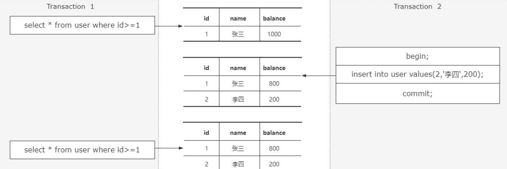
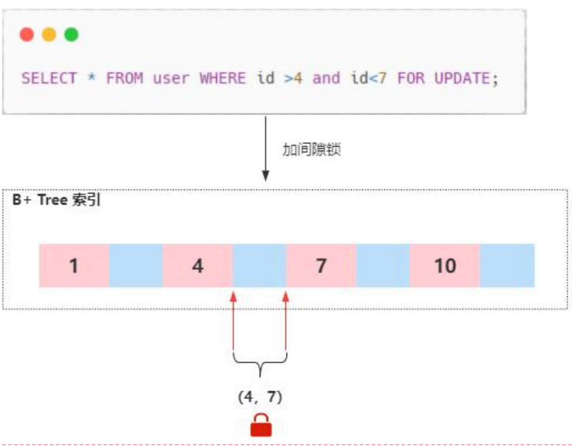
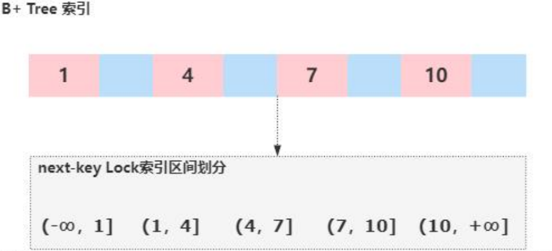
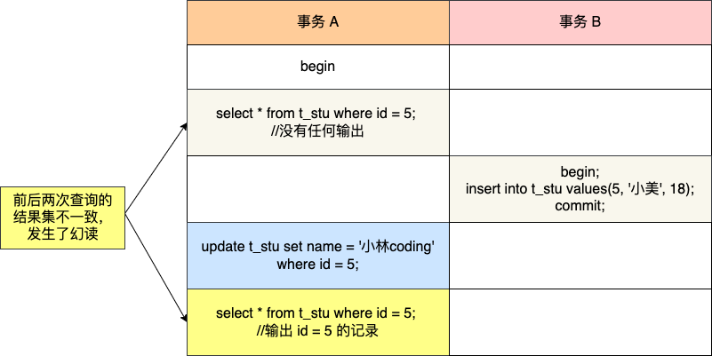

# 硬件层面

占比比较高的复杂SQL查询，建议用CPU的配置要好一点。如果侧重是大的数据量，但是每条SQL都比较简单，建议有个大的缓冲区。

### 查看 `buffer_pool` 大小

要查看当前 `InnoDB buffer pool` 的大小，可以通过以下几种方法：

1. **使用 `SHOW VARIABLES` 命令**：
   ```sql
   SHOW VARIABLES LIKE 'innodb_buffer_pool_size';
   ```
   这个命令将返回当前配置的 buffer pool 大小。

| Variable_name           | Value     |
| ----------------------- | --------- |
| innodb_buffer_pool_size | 134217728 |

默认是128mb

### 设置 `buffer_pool` 大小

要设置 `InnoDB buffer pool` 大小，可以通过修改 MySQL 配置文件 `my.cnf` 或 `my.ini`，或者在运行时通过 SQL 命令设置（建议在配置文件中设置以确保重启后配置依然有效）。

1. **通过配置文件设置**：

   在 MySQL 配置文件（`my.cnf` 或 `my.ini`）中添加或修改 `innodb_buffer_pool_size` 参数。例如，将 buffer pool 大小设置为 2GB：
   ```ini
   [mysqld]
   innodb_buffer_pool_size = 2G
   ```

修改后，需要重启 MySQL 服务以使配置生效。

2. **在运行时动态设置**（MySQL 5.7.5 及以上版本支持动态调整）：

   在运行时可以使用以下命令动态设置 buffer pool 大小：
   ```sql
   SET GLOBAL innodb_buffer_pool_size = 2147483648; -- 2GB in bytes
   ```

   请注意，动态调整 buffer pool 大小可能会导致暂时的性能下降，因此在生产环境中应谨慎进行。

### 计算适当的 `buffer_pool` 大小

设置适当的 `buffer_pool` 大小取决于你的服务器内存和数据库大小。一般建议将 `InnoDB buffer pool` 大小设置为物理内存的 60-80%。例如，如果你的服务器有 16GB 内存，设置为 10-12GB 是比较合适的。

### 监控 `buffer_pool` 使用情况

监控 buffer pool 的使用情况可以帮助你优化配置。可以使用以下命令查看 buffer pool 的详细信息：
```sql
SHOW ENGINE INNODB STATUS;
```
在输出中，查看 "BUFFER POOL AND MEMORY" 部分以了解当前的 buffer pool 使用情况，包括命中率、页读写次数等。

存储引擎，如果没有强事务的要求，那就用MyISAM引擎，关系数据库强在对事务的支持，但是对事务的支持牺牲了很多的性能。

MySQL默认的事务隔离级别是RR(可重复读)，但是实际上很多线上数据库都是RC(读已提交)的隔离级别，这样就可以避免很多间隙锁的产生。


# 间隙锁介绍

1、 Mysql 的事务隔离级别Mysql 有四种事务隔离级别，这四种隔离级别代表当存在多个事务并发冲突时，可能出

现的脏读、不可重复读、幻读的问题。

其中 InnoDB 在 RR 的隔离级别下，解决了幻读的问题。


2、**什么是幻读？**

那么，什么是幻读呢？

幻读是指在同一个事务中，前后两次查询相同的范围时，得到的结果不一致（我们来看

这个图）

第一个事务里面我们执行了一个范围查询，这个时候满足条件的数据只有一条

第二个事务里面，它插入了一行数据，并且提交了

接着第一个事务再去查询的时候，得到的结果比第一查询的结果多出来了一条数



所以，幻读会带来数据一致性问题。

**3、InnoDB如何解决幻读的问题**

InnoDB引入了间隙锁和next-keyLock机制来解决幻读问题，为了更清晰的说明这两

种锁，我举一个例子：

假设现在存在这样（图片）这样一个B+Tree的索引结构，这个结构中有四个索引元

素分别是：1、4、7、10。


当我们通过主键索引查询一条记录，并且对这条记录通过for update加锁

SELECT * FROM user WHERE id = 1 FOR UPDATE;

这个时候，会产生一个记录锁，也就是行锁，锁定id=1这个索引


被锁定的记录在锁释放之前，其他事务无法对这条记录做任何操作。前面我说过对幻读的定义：幻读是指在同一个事务中，前后两次查询相同的范围时，

得到的结果不一致！注意，这里强调的是范围查询，

也就是说，InnoDB引擎要解决幻读问题，必须要保证一个点，就是如果一个事务通过这样一条语句（如图）进行锁定时。

SELECT * FROM user WHERE id >4 and id<7 FOR UPDATE;

另外一个事务再执行这样一条（显示图片）insert语句，需要被阻塞，直到前面获得锁的事务释放。

INSERT INTO user(id,name) VALUES(5, 'mimi');

所以，在InnoDB中设计了一种间隙锁，它的主要功能是锁定一段范围内的索引记录（如图）

当对查询范围id>4 and id<7加锁的时候，会针对B+树中（4，7）这个开区间范围的索引加间隙锁。意味着在这种情况下，其他事务对这个区间的数据进行插入、更新、删除都会被锁住。



但是，还有另外一种情况，比如像这样

SELECT *FROM user WHERE id>4 FOR UPDATE;

这条查询语句是针对id>4这个条件加锁，那么它需要锁定多个索引区间，所以在这种

情况下InnoDB引入了next-keyLock机制。

next-keyLock相当于间隙锁和记录锁的合集，记录锁锁定存在的记录行，间隙锁锁住

记录行之间的间隙，而next-keyLock锁住的是两者之和。（如图所示）



每个数据行上的非唯一索引列上都会存在一把next-key lock，当某个事务持有该数据行的next-key lock时，会锁住一段左开右闭区间的数据。

因此，当通过 id>4这样一种范围查询加锁时，会加next-key Lock，锁定的区间范围是:(4,7],(7,10],(10,+co]

间隙锁和next-keyLock的区别在于加锁的范围，间隙锁只锁定两个索引之间的引用间隙，而next-keyLock会锁定多个索引区间，它包含记录锁和间隙锁。

当我们使用了范围查询，不仅仅命中了Record记录，还包含了Gap间隙，在这种情况下我们使用的就是临键锁，它是MySQL里面默认的行锁算法。

**4、总结**

虽然InnoDB中通过间隙锁的方式解决了幻读问题，但是加锁之后一定会影响到并发性能，因此，如果对性能要求较高的业务场景中，可以把隔离级别设置成RC，这个级别中不存在间隙锁。


### update没加索引会锁全表吗？

Innodb存储引擎默认的隔离级别【可重复读】，在该隔离级别下可能会出现幻读的问题，因此lnnodb自己实现了行锁，通过next-key-lock，来锁住记录本身以及记录之间的间隙，来防止幻读的产生。

如果使用一张表中的主键或者唯一索引作为条件，那么next-key-lock就会退化成记录锁，也就是给一些行记录加锁。

但是如果在update语句中where条件没有使用索引，就会产生全表扫描，就会对所有的记录加 next-key-lock(记录锁+间隙锁)，就相当于锁定了整张表。


在数据量非常大的数据库表执行update操作时，如果没有索引，就会给全表加上临键锁，这个锁会持续比较长的时间，直到事务结束，这期间就只能执行select语句，其他语可无法执行，业务就会停滞，影响非常大。

如何避免这种问题的发生?
	设置 sql_safe_updates=1，该参数值为1时update语句必须满足下面的条件之一才能执行

- 索引列使用where，并且where条件中必须有
- 使用limit
- 同时使用where和limit，这时where中可以没有索引。


多版本并发控制（Multiversion Concurrency Control, MVCC）是一种用于处理数据库系统中并发事务的技术。MVCC 通过保存数据的多个版本，允许读操作和写操作同时进行，从而提高系统的并发性能和数据一致性。


### MVCC的工作原理

MVCC 的基本思想是通过维护数据的多个版本，来管理并发事务中的读写操作。每个事务在开始时会获得一个唯一的时间戳或事务ID，用于标识该事务的时间点。根据这些时间戳，数据库能够确定在任何时刻哪个版本的数据对某个事务是可见的。

#### 关键概念

1. **事务ID（Transaction ID, TID）**：
   - 每个事务在开始时分配一个唯一的事务ID，用于标识事务的顺序。
   
2. **版本链**：
   - 每条记录都有一个版本链，保存该记录的多个版本。每个版本包括事务ID、数据值，以及指向下一个版本的指针。

3. **快照（Snapshot）**：
   - 每个事务在开始时都会创建一个快照，包含当前可见的所有数据版本。事务只能看到在快照创建之前提交的数据版本，而不受之后其他事务的影响。

4. **数据可见性**：
   - 当事务读取数据时，MVCC 会根据事务ID和版本链，返回对该事务可见的最新版本数据。写操作则会创建新版本，并将其添加到版本链中。

### MVCC的实现

MVCC 在不同的数据库系统中有不同的实现方式。以下是 MySQL InnoDB 存储引擎中的 MVCC 实现细节：

1. **隐藏列**：
   - InnoDB 使用两个隐藏列来实现 MVCC：`trx_id` 和 `roll_pointer`。`trx_id` 保存创建该版本的事务ID，`roll_pointer` 指向之前版本的数据（用于实现版本链）。

2. **Read View**：
   - 事务在开始时创建一个 Read View，包含当前活跃事务的列表。InnoDB 通过检查这些事务ID来确定哪些数据版本对当前事务可见。

3. **版本选择**：
   - 读取数据时，InnoDB 会从版本链中选择对当前事务可见的最新版本。如果事务在读取后要修改数据，会创建一个新的数据版本。

### MVCC的优点

- **高并发性能**：读操作不会阻塞写操作，写操作也不会阻塞读操作，极大提高了并发性能。
- **一致性读**：事务读取数据时总是看到一致的视图（快照），避免了脏读、不可重复读和幻读等问题。
- **减少锁争用**：MVCC 通过版本控制代替了许多情况下的行锁，减少了锁争用和死锁的发生。

### MVCC的缺点

- **存储开销**：保存多个版本的数据需要更多的存储空间。
- **版本清理**：需要定期清理旧版本数据（通过机制如 InnoDB 的“垃圾回收”），否则可能导致存储空间膨胀。
- **实现复杂性**：维护多个版本和快照机制增加了数据库系统的实现复杂性。

### 总结

MVCC 通过保存数据的多个版本并利用事务ID来管理数据可见性，提供了一种高效的并发控制机制。它能够在保证数据一致性的同时，提高系统的并发性能，是现代关系型数据库系统中广泛使用的技术。


#### MVCC 如何解决并发问题，比如防止脏读、不可重复读和幻读？**

**回答思路：**

- 通过一致性视图，避免读取未提交的数据，防止脏读。

- 在同一个事务内读取到的数据版本一致，防止不可重复读。

- 通过维护版本链和快照视图，避免幻读问题。

  

MySQL InnoDB 引擎的默认隔离级别虽然是「可重复读」，但是它很大程度上避免幻读现象（并不是完全解决了），解决的方案有两种：

- 针对**快照读**（普通 select 语句），是**通过 MVCC 方式解决了幻读**，因为可重复读隔离级别下，事务执行过程中看到的数据，一直跟这个事务启动时看到的数据是一致的，即使中途有其他事务插入了一条数据，是查询不出来这条数据的，所以就很好了避免幻读问题。
- 针对**当前读**（select ... for update 等语句），是**通过 next-key lock（记录锁+间隙锁）方式解决了幻读**，因为当执行 select ... for update 语句的时候，会加上 next-key lock，如果有其他事务在 next-key lock 锁范围内插入了一条记录，那么这个插入语句就会被阻塞，无法成功插入，所以就很好了避免幻读问题.


在数据库中，尤其是使用MySQL等关系型数据库时，“当前读”和“快照读”是两种重要的读取方式，它们在处理并发事务时表现不同，主要区别在于读取数据的时机和一致性。

### 当前读（Current Read）
**当前读** 是指读取数据时获取的是最新版本的数据，并且可能会使用锁来确保数据的一致性。当前读在读取数据的同时会锁定读取到的行，防止其他事务同时修改这些行，保证在当前事务中对数据的修改是基于最新的数据。

#### 常见的当前读操作
- `SELECT ... FOR UPDATE`


`SELECT ... FOR UPDATE` 是一种用于事务处理中锁定查询结果集的 SQL 语句，常用于需要对查询到的数据进行后续修改的场景。它的主要作用是在查询过程中锁定选定的行，防止其他事务同时修改这些行，确保数据的一致性和完整性。

### 使用场景
1. **防止脏读和幻读**：在一个事务中读取数据并准备修改时，通过 `SELECT ... FOR UPDATE` 可以锁定相关行，防止其他事务在此期间对这些行进行修改，避免出现脏读和幻读现象。
2. **确保数据一致性**：在需要对查询到的数据进行更新时，使用该语句可以确保其他事务无法同时修改这些数据，从而保证数据的操作顺序和一致性。

### 语法
```sql
SELECT column1, column2, ...
FROM table_name
WHERE condition
FOR UPDATE;
```

### 示例
假设有一个银行账户表 `accounts`，包含 `account_id` 和 `balance` 列。为了确保在读取账户余额后进行的任何操作（如转账）都是基于最新且未被其他事务修改的数据，可以使用 `SELECT ... FOR UPDATE`。

```sql
START TRANSACTION;

-- 锁定 account_id = 1 的行
SELECT balance
FROM accounts
WHERE account_id = 1
FOR UPDATE;

-- 执行其他操作，如更新余额
UPDATE accounts
SET balance = balance - 100
WHERE account_id = 1;

COMMIT;
```

在上述示例中，当事务开始后，`SELECT ... FOR UPDATE` 锁定了 `account_id = 1` 的行，直到事务结束时（通过 `COMMIT` 或 `ROLLBACK`），其他事务将无法对该行进行修改。

### 注意事项
- **锁定范围**：`FOR UPDATE` 锁定的行范围取决于查询的条件，通常是基于主键或唯一索引来锁定特定行。
- **死锁风险**：如果多个事务同时使用 `SELECT ... FOR UPDATE` 并且锁定的顺序不一致，可能会导致死锁问题，需要注意避免这种情况。
- **性能影响**：锁定行会阻塞其他事务对这些行的修改操作，因此应尽量缩小锁定的范围和时间，避免长时间持有锁。

`SELECT ... FOR UPDATE` 是事务处理中的重要工具，通过锁定查询结果集，可以有效避免并发修改导致的数据不一致问题，确保数据操作的原子性和可靠性。


- `SELECT ... LOCK IN SHARE MODE`


`SELECT ... LOCK IN SHARE MODE` 是一种用于并发控制的 SQL 语句，它在读取数据时获取共享锁（Share Lock），以防止其他事务同时对这些行进行修改。与 `SELECT ... FOR UPDATE` 类似，它主要用于确保数据读取后的一致性，但与后者不同的是，它允许其他事务读取这些行，但不允许其他事务对其进行修改，直到当前事务结束。

### 使用场景
`SELECT ... LOCK IN SHARE MODE` 适用于需要读取数据并确保数据在读取后的状态不会被其他事务修改，但可以允许其他事务读取的场景。例如，进行某些数据检查或报告生成时，需要确保数据的一致性，但无需阻塞其他读取操作。

### 语法
```sql
SELECT column1, column2, ...
FROM table_name
WHERE condition
LOCK IN SHARE MODE;
```

### 示例
假设有一个图书库存表 `books`，包含 `book_id` 和 `stock` 列。在生成库存报告时，需要确保读取的库存数据在整个报告生成过程中不被修改，可以使用 `SELECT ... LOCK IN SHARE MODE`：

```sql
START TRANSACTION;

-- 共享锁定 book_id = 1 的行，允许其他事务读取，但不允许修改
SELECT stock
FROM books
WHERE book_id = 1
LOCK IN SHARE MODE;

-- 执行其他操作，如生成库存报告
-- ...

COMMIT;
```

在上述示例中，`SELECT ... LOCK IN SHARE MODE` 对 `book_id = 1` 的行加了共享锁，确保在生成报告期间，其他事务不能修改这行数据，但可以读取它。

### 注意事项
- **共享锁与排他锁**：`LOCK IN SHARE MODE` 会对选定的行加共享锁，多个事务可以同时对同一行加共享锁，但如果有其他事务试图对这些行加排他锁（例如使用 `SELECT ... FOR UPDATE` 或执行 `UPDATE`/`DELETE` 操作），则会被阻塞，直到共享锁释放。
- **死锁风险**：如果多个事务同时对同一组数据使用 `LOCK IN SHARE MODE` 并尝试进一步修改数据，可能会导致死锁情况，需要小心处理。
- **性能影响**：虽然共享锁不会阻塞其他读取操作，但会阻塞写操作，可能影响系统的整体性能，特别是在高并发写操作的场景下。

### 对比 `SELECT ... FOR UPDATE`
- **`SELECT ... FOR UPDATE`**：
  - 获取排他锁，阻止其他事务读取和修改。
  - 适用于读取后立即修改的场景。
- **`SELECT ... LOCK IN SHARE MODE`**：
  - 获取共享锁，允许其他事务读取但阻止修改。
  - 适用于需要读取数据但不立即修改，只需确保数据在读取后的状态不变的场景。

### 总结
`SELECT ... LOCK IN SHARE MODE` 提供了一种在读取数据时确保数据一致性的方式，适用于需要读取数据并防止其被修改的场景，但不会完全阻止其他事务的读取操作。它在事务处理中是一种重要的工具，能在保证数据一致性的同时，提供一定程度的并发性。


- `UPDATE`
- `DELETE`
- `INSERT`

**示例：**
```sql
START TRANSACTION;

-- 当前读：锁定 account_id = 1 的行
SELECT balance
FROM accounts
WHERE account_id = 1
FOR UPDATE;

-- 执行其他操作，如更新余额
UPDATE accounts
SET balance = balance - 100
WHERE account_id = 1;

COMMIT;
```

在上述示例中，`SELECT ... FOR UPDATE` 是当前读，锁定了读取到的行，确保在事务期间其他事务不能修改这些行。

### 快照读（Snapshot Read）
**快照读** 是指读取数据时获取的是一个一致性视图（snapshot），这个视图是在事务开始时创建的。快照读不会锁定读取到的行，可以避免阻塞其他事务的写操作。快照读主要用于实现数据库的多版本并发控制（MVCC），在事务隔离级别为可重复读（REPEATABLE READ）或读已提交（READ COMMITTED）时起作用。

#### 常见的快照读操作
- `SELECT`（没有锁定操作，如 `FOR UPDATE` 或 `LOCK IN SHARE MODE`）

**示例：**
```sql
START TRANSACTION;

-- 快照读：读取的是事务开始时的一致性视图
SELECT balance
FROM accounts
WHERE account_id = 1;

-- 此时其他事务可以修改 account_id = 1 的行

COMMIT;
```

在上述示例中，`SELECT` 语句是快照读，它读取的是事务开始时的一致性视图，不会锁定行，允许其他事务并发修改这些行。

### 对比和选择
- **当前读**：
  - 读取最新数据并锁定行。
  - 针对**当前读**（select ... for update 等语句），是通过 next-key lock（记录锁+间隙锁）方式解决了幻读。
  - 适用于需要确保读取后数据不会被其他事务修改的场景，如实现悲观锁机制。
  - 可能会导致更多的锁争用和阻塞。
- **快照读**：
  - 读取一致性视图，不会锁定行。
  - 针对**快照读**（普通 select 语句），是通过 MVCC 方式解决了幻读。
  - 适用于读取操作多、写操作少的场景，如实现乐观锁机制。
  - 可能会读取到旧数据，适合于事务隔离级别为可重复读或读已提交的场景。

选择哪种读取方式取决于具体应用场景和对数据一致性及性能的要求。当前读适合对数据一致性要求高且可以容忍一定锁等待的场景，而快照读适合读取频繁且需要高并发性能的场景。


### 极端场景中的幻读问题

### 示例场景

**场景1**：当事务 A 更新了一条事务 B 插入的记录，那么事务 A 前后两次查询的记录条目就不一样了，所以就发生幻读。

假设有一个 `products` 表，包含如下记录：
```sql
id | name  | price
1  | Apple | 10
2  | Banana| 20
3  | Cherry| 30
```

**场景1：范围查询更新**

还是以这张表作为例子：


事务 A 执行查询 id = 5 的记录，此时表中是没有该记录的，所以查询不出来。

```sql
# 事务 A
mysql> begin;
Query OK, 0 rows affected (0.00 sec)

mysql> select * from t_stu where id = 5;
Empty set (0.01 sec)
```

然后事务 B 插入一条 id = 5 的记录，并且提交了事务。

```sql
# 事务 B
mysql> begin;
Query OK, 0 rows affected (0.00 sec)

mysql> insert into t_stu values(5, '小美', 18);
Query OK, 1 row affected (0.00 sec)

mysql> commit;
Query OK, 0 rows affected (0.00 sec)
```

此时，**事务 A 更新 id = 5 这条记录，对没错，事务 A 看不到 id = 5 这条记录，但是他去更新了这条记录，这场景确实很违和，然后再次查询 id = 5 的记录，事务 A 就能看到事务 B 插入的纪录了，幻读就是发生在这种违和的场景**。

```sql
# 事务 A
mysql> update t_stu set name = '小林coding' where id = 5;
Query OK, 1 row affected (0.01 sec)
Rows matched: 1  Changed: 1  Warnings: 0

mysql> select * from t_stu where id = 5;
+----+--------------+------+
| id | name         | age  |
+----+--------------+------+
|  5 | 小林coding   |   18 |
+----+--------------+------+
1 row in set (0.00 sec)
```

整个发生幻读的时序图如下：



在可重复读隔离级别下，事务 A 第一次执行普通的 select 语句时生成了一个 ReadView，之后事务 B 向表中新插入了一条 id = 5 的记录并提交。接着，事务 A 对 id = 5 这条记录进行了更新操作，在这个时刻，这条新记录的 trx_id 隐藏列的值就变成了事务 A 的事务 id，之后事务 A 再使用普通 select 语句去查询这条记录时就可以看到这条记录了，于是就发生了幻读。

因为这种特殊现象的存在，所以我们认为 **MySQL Innodb 中的 MVCC 并不能完全避免幻读现象**。


**场景2：一开始快照读，后面当前读，没有在一开始就开启当前读**

除了上面这一种场景会发生幻读现象之外，还有下面这个场景也会发生幻读现象。

- T1 时刻：事务 A 先执行「快照读语句」：select * from t_test where id > 100 得到了 3 条记录。
- T2 时刻：事务 B 往插入一个 id= 200 的记录并提交；
- T3 时刻：事务 A 再执行「当前读语句」 select * from t_test where id > 100 for update 就会得到 4 条记录，此时也发生了幻读现象。

**要避免这类特殊场景下发生幻读的现象的话，就是尽量在开启事务之后，马上执行 select ... for update 这类当前读的语句**，因为它会对记录加 next-key lock，从而避免其他事务插入一条新记录。


**场景3：非唯一索引**

假设我们在 `price` 上有一个非唯一索引：

事务A开始：
```sql
START TRANSACTION;
SELECT * FROM products WHERE price = 20 FOR UPDATE;
```
此时，事务A锁定了 `Banana` 记录，但是由于使用了非唯一索引，间隙锁可能无法完全覆盖。

事务B开始并尝试插入一个新的记录：
```sql
START TRANSACTION;
INSERT INTO products (id, name, price) VALUES (4, 'Date', 20);
COMMIT;
```
尽管事务A已经锁定了 `Banana` 的记录，但事务B可能仍然成功插入了新的记录 `Date`，导致幻读。


### 解决办法

要完全解决这些极端场景下的幻读问题，可以考虑以下方法：

1. **使用更高级别的隔离级别：**
   - 可以使用串行化（Serializable）隔离级别。这是最高的隔离级别，通过完全锁定相关的表，防止其他事务进行任何并发操作，从而避免幻读。

2. **显式锁定：**
   - 在范围查询时，显式使用 `FOR UPDATE` 或 `LOCK IN SHARE MODE` 来锁定相应的记录和间隙。

### 示例改进

对于上述的第一个场景，可以这样改进：
```sql
START TRANSACTION;
UPDATE products SET price = price * 1.1 WHERE price BETWEEN 10 AND 20 FOR UPDATE;
```

通过显式添加 `FOR UPDATE`，可以避免其他事务在范围内插入新的记录，从而避免幻读。

### 总结

虽然InnoDB的可重复读隔离级别在大多数情况下可以避免幻读问题，但在某些极端场景下仍然可能出现幻读。为了完全避免幻读，可以考虑使用更高级别的隔离级别（如串行化）或者在事务中显式地锁定相关记录和间隙。


一般情况下，拿到慢SQL后，explain一下它的执行过程，然后去创建对应的索引，保证我们SQL能命中这个索引，然后这个慢SQL问题就解决了。这个方案在某些场景下是没什么用，两个例子：商品主数据提供了一个按更新时间分页查询商品主数据的接口，然后下游服务定时全量拉取商品数据。每次都会出现大量的慢SQL，大量的慢SQL影响到了数据库整个的性能，这本质上是“深分页”的问题，这个方式可以通过让下游传id过来，id是商品表主键，主键是递增的，然后每次查询用id>${id}的方式做范围查询，分页查询转换成了范围查询解决深分页的问题。第二个例子，古老的发票服务，一个MySQL的实例存储了十亿的数据，在不改造的前提下，最后优化的方案是把buffer pool大小从128M调到几个G。

三层B+数能存多少数据，十亿数据差不多是四层，相比三层B+树，多了一次随机IO读取，所以不是随机IO造成的性能下降，MySQL它是以页为最小存储单位的数据库，一页16K

一些重要的条件
页的大小:16k;
非叶子节点中的主键大小:假设是bigint类型，8byte:

非叶子节点中的页指针大小:6byte;
叶子节点中每一行记录大小:假设为1k;


计算过程
第一层中索引数量

最少:2条;
最多:16 * *1024/(6+8)=1170条;*

第二层索引数量
最少:1170+1=1171条;

最多:1170 * 1170=1368900条

叶子节点中的记录数
最少:1170 * *16+1=18721条;*

*最多:1368900*  * 16=21902400条;

差不多2千万条


对数据库的连接数做优化，日志的写入从随机变成顺序写，把每次事务的持久化变成批量事务的持久化。还可以去设置很多缓冲区的大小，比如说索引的缓冲区，表的缓冲区，查询的缓冲区，排序的缓冲区。varchar，char，text。datatime，timestamp。除了explain，还有optimizer trace更详细。索引覆盖，索引下推，尽量避免Select *。存储架构:先优化索引，再看看能不能加缓存，再看下能不能用异步化，最后我们可能才会去做分库分表，运维的成本是逐渐增加的。分表更多是你单标数据量太大了，索引效率太低，更多是优化索引的效率，所以要把表进行拆分，分库更多是你的并发量，导致连接数可能不够用了，你才要去做分库，两者侧重点不一样。分库不止可以水平分，我们也可以去做成读写分离，当然也要考虑主从延迟对业务带来的影响。分表也不一定水平分，也可以周期性做冷热分离。用比较低的成本达到比较高的收益。数据库的一些反范式设计，加冗余字段，可以查询更方便，但是写入事务其实也拉大。甚至可能出现分布式事务的问题，这就要考虑业务对一致性的要求有多高，它读写的占比有多大


https://xiaolincoding.com/mysql/transaction/phantom.html#%E7%AC%AC%E4%B8%80%E4%B8%AA%E5%8F%91%E7%94%9F%E5%B9%BB%E8%AF%BB%E7%8E%B0%E8%B1%A1%E7%9A%84%E5%9C%BA%E6%99%AF


https://juejin.cn/post/7258445421417660475


### 问题 1: 你通常如何排查和定位数据库性能问题？

**详细操作步骤:**

1. **使用监控工具:**
   - **工具选择:** 选择合适的监控工具，如MySQL慢查询日志、Oracle AWR报告、New Relic、Prometheus、Grafana等。
   - **安装和配置:** 安装并配置这些工具，使其能够监控数据库性能并记录关键指标。
   - **数据收集:** 收集监控数据，包括查询执行时间、CPU使用率、内存使用率、磁盘I/O等。

2. **分析SQL查询:**
   - **开启慢查询日志（MySQL为例）:**
   
	```sql
	SHOW VARIABLES LIKE 'slow_query_log';
   
	show variables like 'slow_query_log';
	```

	你可能会看到如下结果：

	```text
	+----------------+-------+
	| Variable_name  | Value |
	+----------------+-------+
	| slow_query_log | ON    |
	+----------------+-------+
   
     ```sql
     SET GLOBAL slow_query_log = 'ON';
     SET GLOBAL long_query_time = 1;  -- 设置慢查询时间阈值为1秒
   ```
   - **检查慢查询日志:** 定期查看慢查询日志，找出执行时间长的SQL语句。
   - **使用EXPLAIN分析查询:**
     ```sql
     EXPLAIN SELECT * FROM your_table WHERE condition;
     ```
     分析查询计划，检查索引使用情况和执行顺序。

3. **检查系统资源:**
   - **使用系统工具:** 使用工具如`top`、`htop`、`iostat`、`vmstat`等监控服务器的系统资源使用情况。
   - **资源瓶颈:** 观察CPU、内存、磁盘I/O的使用情况，确定是否存在资源瓶颈。

4. **分析锁和等待:**
   - **查看锁情况:** 在MySQL中，可以使用以下命令查看锁和等待情况：
     ```sql
     SHOW ENGINE INNODB STATUS;
     SHOW PROCESSLIST;
     ```
   - **分析等待事件:** 检查是否存在大量的锁等待，分析导致锁等待的原因。

5. **检查应用层:**
   - **连接池配置:** 查看应用程序的数据库连接池配置，确保最大连接数、最小连接数、连接超时时间等参数合理。
   - **优化连接池:** 根据应用负载调整连接池参数，避免频繁创建和销毁连接。

### 问题 2: 请描述一次你排查并优化数据库性能问题的实际案例。

**详细操作步骤:**

1. **问题描述:** 假设某次线上应用响应时间变慢，初步排查发现问题出在数据库性能上。

2. **排查过程:**
   - **收集信息:**
     - 使用New Relic监控应用性能，发现数据库响应时间较长。
     - 检查New Relic的查询性能报告，定位到响应时间较长的SQL查询。
   
   - **分析SQL:**
     - **查看慢查询日志:** 定位到执行时间长的SQL语句。
     - **使用EXPLAIN分析执行计划:** 查看SQL查询的执行计划，检查是否存在全表扫描或索引未使用的情况。
       ```sql
       EXPLAIN SELECT * FROM your_table WHERE condition;
       ```
     - **优化SQL:** 根据执行计划，添加或调整索引，重写低效的查询语句。
   
   - **检查系统资源:**
     - **使用iostat检查磁盘I/O:** 发现磁盘I/O压力较大。
       ```sh
       iostat -x 1 10
       ```
     - **优化系统配置:** 调整数据库配置参数，如增加缓冲池大小。
       ```sql
       SET GLOBAL innodb_buffer_pool_size = 'size';
       ```

3. **结果:** 通过优化SQL和系统配置，慢查询的执行时间显著降低，应用的整体响应时间恢复正常。

### 问题 3: 如何预防数据库性能问题？

**详细操作步骤:**

1. **合理的数据库设计:**
   - **范式化:** 设计表结构时，遵循范式化原则，确保数据的一致性和完整性。
   - **反范式化:** 根据业务需求，适当进行反范式化，优化查询性能。

2. **索引策略:**
   - **创建索引:** 根据查询需求，创建合适的索引，如单列索引、复合索引、全文索引等。
   - **维护索引:** 定期重建和优化索引，确保索引的有效性。
     ```sql
     OPTIMIZE TABLE your_table;
     ```

3. **SQL优化:**
   - **定期审查:** 定期审查和优化SQL查询，避免复杂的联接和子查询。
   - **高效查询:** 尽量使用高效的查询语句，减少查询的执行时间。
     ```sql
     SELECT columns FROM your_table WHERE condition;
     ```

4. **监控和报警:**
   - **部署监控:** 部署数据库监控系统，如Prometheus和Grafana，监控关键指标。
   - **设置报警:** 设置关键指标的报警阈值，及时发现和处理性能问题。

5. **容量规划:**
   - **业务预测:** 根据业务增长预测，提前规划和扩展数据库容量。
   - **定期评估:** 定期评估数据库的容量和性能，进行必要的调整。

6. **备份和恢复:**
   - **定期备份:** 定期进行数据库备份，确保数据的安全性。
     ```sh
     mysqldump -u username -p database_name > backup.sql
     ```
   - **恢复演练:** 定期进行恢复演练，确保在出现问题时能够快速恢复。

### 问题 4: 你对数据库连接池的了解如何？它是如何影响数据库性能的？

**详细操作步骤:**

1. **数据库连接池:**
   - **定义:** 数据库连接池是一个管理数据库连接的组件，可以重用已经建立的连接，减少频繁创建和销毁连接的开销。
   - **工作原理:** 连接池在初始化时创建一定数量的连接，并在需要时分配给应用程序使用，使用完毕后归还连接池。

2. **性能影响:**
   - **连接复用:** 通过复用连接，减少了数据库和应用服务器之间的连接建立和释放的开销，提高了性能。
   - **资源控制:** 连接池可以限制同时打开的连接数，防止过多连接导致数据库资源耗尽。

3. **连接池配置:**
   - **最大连接数:** 设置连接池的最大连接数，根据应用负载和数据库承载能力进行调整。
   - **最小连接数:** 设置连接池的最小连接数，确保在低负载时也能快速响应。
   - **连接超时:** 设置连接超时参数，避免长时间闲置的连接占用资源。

4. **调优连接池:**
   - **监控连接池:** 使用监控工具（如JMX、VisualVM）监控连接池的使用情况。
   - **调整参数:** 根据监控数据，调整连接池参数，确保性能最佳。
     ```java
     // 示例代码：HikariCP连接池配置
     HikariConfig config = new HikariConfig();
     config.setMaximumPoolSize(10);
     config.setMinimumIdle(2);
     config.setConnectionTimeout(30000);
     ```

### 测试死锁
```sql
CREATE TABLE test_dead_lock ( id INT PRIMARY KEY, NAME VARCHAR ( 50 ), age INT );

INSERT INTO `test_dead_lock`(`id`, `NAME`, `age`) VALUES (1, 'lisi', 11);
INSERT INTO `test_dead_lock`(`id`, `NAME`, `age`) VALUES (2, 'zhangsan', 22);
INSERT INTO `test_dead_lock`(`id`, `NAME`, `age`) VALUES (3, 'wangwu', 33);
SELECT * FROM test_dead_lock;

--查看当前运行的所有事务
select * from information_schema.innodb_trx;

--查看死锁日志
show engine INNODB status;

mysql版本不同。 命令不同。

5.7

--查看加锁信息
select * from information_schema.innodb_locks;
--查看锁等待的信息
select * from information_schema.innodb_lock_waits
--查看当前MySQL的事务隔离级别
select @@tx_isolation;

8.0
--查看加锁信息
select * from performance_schema.data_locks;
--查看锁等待的信息
select * from performance_schema.data_lock_waits;
--查看当前MySQL的事务隔离级别
select @@transaction_isolation;

```


### 案例分析

mysql 5.7 为select @@tx_isolation;

本次使用的MySQL版本为8.4

```sql
mysql> select @@transaction_isolation;
+-------------------------+
| @@transaction_isolation |
+-------------------------+
| REPEATABLE-READ         |
+-------------------------+
```


查看查看当前运行的所有事务，简化版SQL

```sql
SELECT 
	trx_id '事务ID',
	trx_state '事务状态',
	trx_started '事务开始时间',
	trx_weight '事务权重',
	trx_mysql_thread_id '事务线程ID',
	trx_tables_locked '事务锁定的行数',
	trx_rows_modified '事务修改的行数' 
FROM
	information_schema.innodb_trx;
```


详细步骤：

```sql
-- 窗口1
mysql> begin;
Query OK, 0 rows affected (0.00 sec)

-- 窗口2
mysql> begin;
Query OK, 0 rows affected (0.00 sec)

-- 注意begin后如果没有操作，select * from information_schema.innodb_trx;是查不到数据的，只有执行过一条sql语句才会有数据
mysql> select * from information_schema.innodb_trx;
Empty set (0.00 sec)

-- 窗口1
mysql> select * from test_dead_lock where id = 1 for update;
+----+------+------+
| id | NAME | age  |
+----+------+------+
|  1 | lisi |   11 |
+----+------+------+
1 row in set (0.00 sec)

-- 可以看到当窗口1执行了一条sql语句后，information_schema.innodb_trx就开始有了窗口1事务的数据,此时事务id为4926
mysql> SELECT
    -> trx_id '事务ID',
    -> trx_state '事务状态',
    -> trx_started '事务开始时间',
    -> trx_weight '事务权重',
    -> trx_mysql_thread_id '事务线程ID',
    -> trx_tables_locked '事务锁定的行数',
    -> trx_rows_modified '事务修改的行数'
    -> FROM
    -> information_schema.innodb_trx;
+----------+--------------+---------------------+--------------+----------------+-----------------------+-----------------------+
| 事务ID   | 事务状态     | 事务开始时间        | 事务权重     | 事务线程ID     | 事务锁定的行数        | 事务修改的行数        |
+----------+--------------+---------------------+--------------+----------------+-----------------------+-----------------------+
|     4926 | RUNNING      | 2024-06-03 16:05:02 |            2 |             15 |                     1 |                     0 |
+----------+--------------+---------------------+--------------+----------------+-----------------------+-----------------------+
1 row in set (0.00 sec)


-- 窗口2
mysql> begin;
Query OK, 0 rows affected (0.00 sec)

mysql> delete from test_dead_lock where id = 3;

Query OK, 1 row affected (0.00 sec)

-- 可以看到当窗口2执行了一条sql语句后，information_schema.innodb_trx就开始有了窗口2事务的数据，事务id为4927
mysql> SELECT
    -> trx_id '事务ID',
    -> trx_state '事务状态',
    -> trx_started '事务开始时间',
    -> trx_weight '事务权重',
    -> trx_mysql_thread_id '事务线程ID',
    -> trx_tables_locked '事务锁定的行数',
    -> trx_rows_modified '事务修改的行数'
    -> FROM
    -> information_schema.innodb_trx;
+----------+--------------+---------------------+--------------+----------------+-----------------------+-----------------------+
| 事务ID   | 事务状态     | 事务开始时间        | 事务权重     | 事务线程ID     | 事务锁定的行数        | 事务修改的行数        |
+----------+--------------+---------------------+--------------+----------------+-----------------------+-----------------------+
|     4927 | RUNNING      | 2024-06-03 16:07:06 |            3 |             12 |                     1 |                     1 |
|     4926 | RUNNING      | 2024-06-03 16:05:02 |            2 |             15 |                     1 |                     0 |
+----------+--------------+---------------------+--------------+----------------+-----------------------+-----------------------+
2 rows in set (0.00 sec)


-- 窗口1
mysql> update test_dead_lock set name = 'aaa' where id = 3;
-- 窗口1开始阻塞


-- 窗口2
mysql> delete from test_dead_lock where id = 1;
Query OK, 0 rows affected (0.00 sec) -- 删除还是成功了，明明窗口1开始的时候for update锁定了id为1的数据，因为这里删除只是给了标识

-- 然后在窗口2执行删除操作的时候，窗口1就会立刻出现检测到死锁发生的错误信息
ERROR 1213 (40001): Deadlock found when trying to get lock; try restarting transaction


-- 再次执行查看当前事务，发现窗口1的事务(事务id为4926)没了，只有窗口2的数据(事务id为4927)
mysql> SELECT
    -> trx_id '事务ID',
    -> trx_state '事务状态',
    -> trx_started '事务开始时间',
    -> trx_weight '事务权重',
    -> trx_mysql_thread_id '事务线程ID',
    -> trx_tables_locked '事务锁定的行数',
    -> trx_rows_modified '事务修改的行数'
    -> FROM
    -> information_schema.innodb_trx;
+----------+--------------+---------------------+--------------+----------------+-----------------------+-----------------------+
| 事务ID   | 事务状态     | 事务开始时间        | 事务权重     | 事务线程ID     | 事务锁定的行数        | 事务修改的行数        |
+----------+--------------+---------------------+--------------+----------------+-----------------------+-----------------------+
|     4927 | RUNNING      | 2024-06-03 16:07:06 |            5 |             12 |                     1 |                     2 |
+----------+--------------+---------------------+--------------+----------------+-----------------------+-----------------------+
1 row in set (0.00 sec)

```


最后窗口1的事务被取消了事务，窗口2的事务没有被取消，依旧可以commit和rollback


现在就可以查看死锁的信息了：

```sql
show engine INNODB status;
```


我们查看Status这一列，搜索LATEST DETECTED DEADLOCK

死锁日志的查看：

```sql
------------------------
LATEST DETECTED DEADLOCK
------------------------
2024-06-03 16:08:08 0x28e4
*** (1) TRANSACTION:

TRANSACTION 4926, ACTIVE 186 sec starting index read

-- TRANSACTION事务的编号，这里4926就是我们之前的窗口1的事务id，ACTIVE活跃的秒数，starting index read表示事务状态为根据索引读取数据

mysql tables in use 1, locked 1
-- 表示有一张表被使用，locked表示表上有一个表锁，对于DML语句为LOCK_IX

LOCK WAIT 3 lock struct(s), heap size 1128, 2 row lock(s)
MySQL thread id 15, OS thread handle 17160, query id 802 localhost ::1 root updating
update test_dead_lock set name = 'aaa' where id = 3
-- 表示正在等待锁的SQL语句

*** (1) HOLDS THE LOCK(S):
RECORD LOCKS space id 2 page no 4 n bits 72 index PRIMARY of table `study_demo`.`test_dead_lock` trx id 4926 lock_mode X locks rec but not gap
Record lock, heap no 2 PHYSICAL RECORD: n_fields 5; compact format; info bits 0
 0: len 4; hex 80000001; asc     ;;
 1: len 6; hex 000000001329; asc      );;
 2: len 7; hex 820000010f0110; asc        ;;
 3: len 4; hex 6c697369; asc lisi;;
 4: len 4; hex 8000000b; asc     ;;


*** (1) WAITING FOR THIS LOCK TO BE GRANTED:
RECORD LOCKS space id 2 page no 4 n bits 72 index PRIMARY of table `study_demo`.`test_dead_lock` trx id 4926 lock_mode X locks rec but not gap waiting
Record lock, heap no 4 PHYSICAL RECORD: n_fields 5; compact format; info bits 32
```


死锁总结：

1、对索引加锁的顺序不一致，很可能导致死锁，所以应该尽量以相同的顺序来访问索引记录和表。

2.间隙锁往往是程序中导致死锁的元凶，由于MySQL默认隔离级别是RR，会用到间隙锁来防止幻读。所以如果不可重复读和幻读对当前业务影响不大的话，可以考虑降低隔离级别为RC。
3.为表添加合理的索引，如果不走索引就会为表中的每一行数据加锁，死锁的概率增加。

4.避免大事务，尽量将大事务拆分成多个小事务来处理

5.避免在同一时间点运行多个对同一表进行读写的脚本。

6.设置锁等待的超时参数。


附加内容：

mysql5.7

```sql
SELECT
	lock_id '锁的ID',
	1ock_trx_id '拥有锁的事务ID',
	lock_mode '锁的模式',
	LOCK_type '锁的类型',
	lock_table '加锁的表',
	lock_index '被锁的索引',
	lock_space '被锁的表空间号',
	lock_page '被锁的页是',
	lock_rec '被锁的记录号',
	lock_data '被锁的数据' 
FROM
	information_schema.innodb_locks;
```


mysql8.4


```sql
SELECT
    ENGINE_LOCK_ID AS '锁的ID',
    ENGINE_TRANSACTION_ID AS '拥有锁的事务ID',
    LOCK_MODE AS '锁的模式',
    LOCK_TYPE AS '锁的类型',
    CONCAT(OBJECT_SCHEMA, '.', OBJECT_NAME) AS '加锁的表',
    INDEX_NAME AS '被锁的索引',
    OBJECT_INSTANCE_BEGIN AS '被锁的表空间号',
    NULL AS '被锁的页是',  -- MySQL 8.0 没有直接对应的列
    NULL AS '被锁的记录号',  -- MySQL 8.0 没有直接对应的列
    LOCK_DATA AS '被锁的数据'
FROM
    performance_schema.data_locks;


```


我尝试用mysql8 lock_page and lock_rec not find in performance_schema.data_locks去查看，找到

https://dev.mysql.com/doc/refman/8.0/en/performance-schema-data-locks-table.html

这是对应的改动

`INNODB_LOCKS`和 之间的区别[`data_locks`](https://dev.mysql.com/doc/refman/8.0/en/performance-schema-data-locks-table.html)：

- 如果事务持有锁， `INNODB_LOCKS`则仅当另一个事务正在等待时才显示该锁。 [`data_locks`](https://dev.mysql.com/doc/refman/8.0/en/performance-schema-data-locks-table.html)无论是否有任何事务正在等待它，都显示该锁。
- 该[`data_locks`](https://dev.mysql.com/doc/refman/8.0/en/performance-schema-data-locks-table.html)表没有与`LOCK_SPACE`、 `LOCK_PAGE`或 对应的列`LOCK_REC`。
- 该`INNODB_LOCKS`表需要全局[`PROCESS`](https://dev.mysql.com/doc/refman/8.0/en/privileges-provided.html#priv_process)权限。该表需要对要选择的表 [`data_locks`](https://dev.mysql.com/doc/refman/8.0/en/performance-schema-data-locks-table.html)具有通常的性能模式权限 。[`SELECT`](https://dev.mysql.com/doc/refman/8.0/en/privileges-provided.html#priv_select)

`INNODB_LOCKS`下表显示了列与 列之间 的映射 [`data_locks`](https://dev.mysql.com/doc/refman/8.0/en/performance-schema-data-locks-table.html)。使用此信息将应用程序从一个表迁移到另一个表。

**表 29.4 从 INNODB_LOCKS 到 data_locks 列的映射**

| INNODB_LOCKS 列               | data_locks 列                                    |
| :---------------------------- | :----------------------------------------------- |
| `LOCK_ID`                     | `ENGINE_LOCK_ID`                                 |
| `LOCK_TRX_ID`                 | `ENGINE_TRANSACTION_ID`                          |
| `LOCK_MODE`                   | `LOCK_MODE`                                      |
| `LOCK_TYPE`                   | `LOCK_TYPE`                                      |
| `LOCK_TABLE`（组合模式/表名） | `OBJECT_SCHEMA`(模式名称), `OBJECT_NAME`(表名称) |
| `LOCK_INDEX`                  | `INDEX_NAME`                                     |
| `LOCK_SPACE`                  | 没有任何                                         |
| `LOCK_PAGE`                   | 没有任何                                         |
| `LOCK_REC`                    | 没有任何                                         |
| `LOCK_DATA`                   | `LOCK_DATA`                                      |


下面操作基于msql8，mysql5.7的语句看上面

```sql
mysql> SELECT
    ->     ENGINE_LOCK_ID AS '锁的ID',
    ->     ENGINE_TRANSACTION_ID AS '拥有锁的事务ID',
    ->     LOCK_MODE AS '锁的模式',
    ->     LOCK_TYPE AS '锁的类型',
    ->     CONCAT(OBJECT_SCHEMA, '.', OBJECT_NAME) AS '加锁的表',
    ->     INDEX_NAME AS '被锁的索引',
    ->     OBJECT_INSTANCE_BEGIN AS '被锁的表空间号',
    ->     LOCK_DATA AS '被锁的数据'
    -> FROM
    ->     performance_schema.data_locks;
+-----------------------------------+----------------------+---------------+--------------+---------------------------+-----------------+-----------------------+-----------------+
| 锁的ID                            | 拥有锁的事务ID       | 锁的模式      | 锁的类型     | 加锁的表                  | 被锁的索引      | 被锁的表空间号        | 被锁的数据      |
+-----------------------------------+----------------------+---------------+--------------+---------------------------+-----------------+-----------------------+-----------------+
| 2597458092448:1064:2597448456216  |                 4897 | IX            | TABLE        | study_demo.test_dead_lock | NULL            |         2597448456216 | NULL            |
| 2597458092448:2:4:2:2597447139352 |                 4897 | X,REC_NOT_GAP | RECORD       | study_demo.test_dead_lock | PRIMARY         |         2597447139352 | 1               |
| 2597458092448:2:4:4:2597447140040 |                 4897 | X,REC_NOT_GAP | RECORD       | study_demo.test_dead_lock | PRIMARY         |         2597447140040 | 3               |
| 2597458091672:1064:2597448455448  |                 4894 | IX            | TABLE        | study_demo.test_dead_lock | NULL            |         2597448455448 | NULL            |
| 2597458091672:2:4:4:2597447083032 |                 4894 | X,REC_NOT_GAP | RECORD       | study_demo.test_dead_lock | PRIMARY         |         2597447083032 | 3               |
+-----------------------------------+----------------------+---------------+--------------+---------------------------+-----------------+-----------------------+-----------------+
5 rows in set (0.00 sec)
```


查看锁等待的信息

mysql 5.7请用

select * from information_schema.innodb_lock_waits

下列是mysql8.4的操作

```sql
mysql> select * from performance_schema.data_lock_waits;
+--------+-----------------------------------+----------------------------------+----------------------+---------------------+----------------------------------+-----------------------------------+--------------------------------+--------------------+-------------------+--------------------------------+
| ENGINE | REQUESTING_ENGINE_LOCK_ID         | REQUESTING_ENGINE_TRANSACTION_ID | REQUESTING_THREAD_ID | REQUESTING_EVENT_ID | REQUESTING_OBJECT_INSTANCE_BEGIN | BLOCKING_ENGINE_LOCK_ID           | BLOCKING_ENGINE_TRANSACTION_ID | BLOCKING_THREAD_ID | BLOCKING_EVENT_ID | BLOCKING_OBJECT_INSTANCE_BEGIN |
+--------+-----------------------------------+----------------------------------+----------------------+---------------------+----------------------------------+-----------------------------------+--------------------------------+--------------------+-------------------+--------------------------------+
| INNODB | 2597458092448:2:4:4:2597447140384 |                             4897 |                   51 |                  19 |                    2597447140384 | 2597458091672:2:4:4:2597447083032 |                           4894 |                 54 |                12 |                  2597447083032 |
+--------+-----------------------------------+----------------------------------+----------------------+---------------------+----------------------------------+-----------------------------------+--------------------------------+--------------------+-------------------+--------------------------------+
1 row in set (0.00 sec)

mysql>
```


查看锁等待信息

mysql5.7

```sql
SELECT
	requesting_trx_id '请求锁的事务ID',
	requested_lock_id '请求锁的锁ID',
	blocking_trx_id '当前拥有锁的事务ID',
	blocking_lock_id '当前拥有锁的锁ID' 
FROM
	information_schema.innodb_lock_waits;
```


mysql8.4

```sql
mysql> SELECT
    ->     REQUESTING_ENGINE_TRANSACTION_ID AS '请求锁的事务ID',
    ->     REQUESTING_ENGINE_LOCK_ID AS '请求锁的锁ID',
    ->     BLOCKING_ENGINE_TRANSACTION_ID AS '当前拥有锁的事务ID',
    ->     BLOCKING_ENGINE_LOCK_ID AS '当前拥有锁的锁ID'
    -> FROM
    ->     performance_schema.data_lock_waits;
+----------------------+-----------------------------------+----------------------------+-----------------------------------+
| 请求锁的事务ID       | 请求锁的锁ID                      | 当前拥有锁的事务ID         | 当前拥有锁的锁ID                  |
+----------------------+-----------------------------------+----------------------------+-----------------------------------+
|                 4897 | 2597458092448:2:4:4:2597447140728 |                       4894 | 2597458091672:2:4:4:2597447083032 |
+----------------------+-----------------------------------+----------------------------+-----------------------------------+
1 row in set (0.00 sec)
```


https://dev.mysql.com/doc/refman/8.0/en/performance-schema-data-lock-waits-table.html

[`TRUNCATE TABLE`](https://dev.mysql.com/doc/refman/8.0/en/truncate-table.html)不允许用于该[`data_lock_waits`](https://dev.mysql.com/doc/refman/8.0/en/performance-schema-data-lock-waits-table.html)表。

笔记

[`data_lock_waits`](https://dev.mysql.com/doc/refman/8.0/en/performance-schema-data-lock-waits-table.html)在 MySQL 8.0.1 之前，表中提供了 类似于性能模式表中的信息 `INFORMATION_SCHEMA.INNODB_LOCK_WAITS` ，该表提供有关每个被阻止 `InnoDB`事务的信息，指示其请求的锁以及阻止该请求的任何锁。 `INFORMATION_SCHEMA.INNODB_LOCK_WAITS`已弃用并从 MySQL 8.0.1 开始删除。 [`data_lock_waits`](https://dev.mysql.com/doc/refman/8.0/en/performance-schema-data-lock-waits-table.html)应该改用。

这些表在所需的权限方面有所不同： `INNODB_LOCK_WAITS`表需要全局 [`PROCESS`](https://dev.mysql.com/doc/refman/8.0/en/privileges-provided.html#priv_process)权限。 表需要所选表 [`data_lock_waits`](https://dev.mysql.com/doc/refman/8.0/en/performance-schema-data-lock-waits-table.html)的常规性能模式权限 。[`SELECT`](https://dev.mysql.com/doc/refman/8.0/en/privileges-provided.html#priv_select)

`INNODB_LOCK_WAITS`下表显示了列与 列之间 的映射 [`data_lock_waits`](https://dev.mysql.com/doc/refman/8.0/en/performance-schema-data-lock-waits-table.html)。使用此信息将应用程序从一个表迁移到另一个表。


**表 29.5 从 INNODB_LOCK_WAITS 到 data_lock_waits 列的映射**

| INNODB_LOCK_WAITS 列 | data_lock_waits 列                 |
| :------------------- | :--------------------------------- |
| `REQUESTING_TRX_ID`  | `REQUESTING_ENGINE_TRANSACTION_ID` |
| `REQUESTED_LOCK_ID`  | `REQUESTING_ENGINE_LOCK_ID`        |
| `BLOCKING_TRX_ID`    | `BLOCKING_ENGINE_TRANSACTION_ID`   |
| `BLOCKING_LOCK_ID`   | `BLOCKING_ENGINE_LOCK_ID`          |
