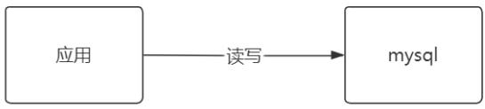
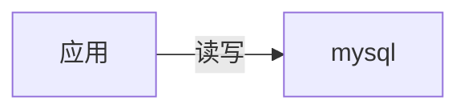
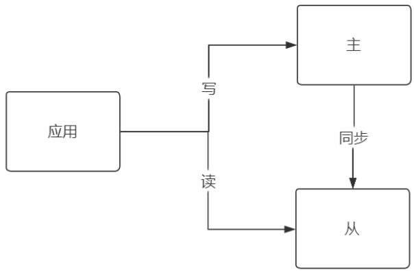
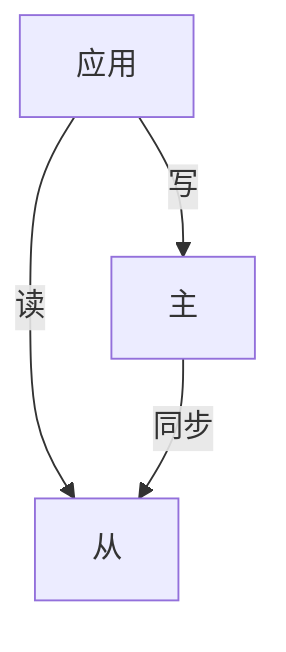
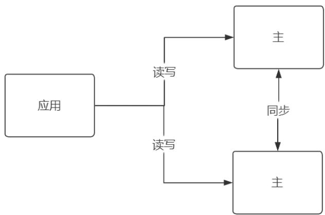
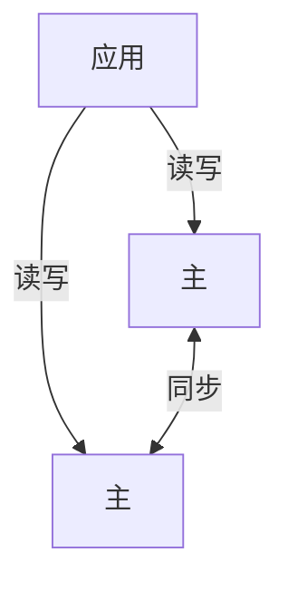
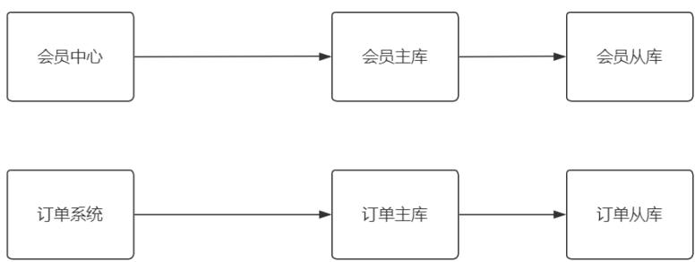
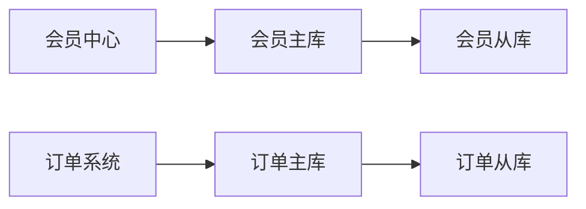

# 数据库的演化历史

# 单机

flowchart

请求量大查询慢  
单机故障导致业务不可用

# 主从

flowchart

数据库主从同步，从库可以水平扩展，满足更大读需求  
但单服务器TPS，内存，IO都是有限的

# 双主/多主

flowchart

用户量级上来后，写请求越来越多  
一个Master是不能解决问题的，添加多了个主节点进行写入，  
多个主节点数据要保存一致性，写操作需要2个master之间同步更加复杂

# 分库分表

flowchart

将数据水平与垂直拆分，应对不断增大的数据变化

问题来了，针对TP、PB级别的数据，传统的MySQL数据库已经力不从心，尤其是以数据分析这种典型“全盘”扫描的统计业务，大规模扫盘已让MySQL不堪重负，为了解决这类问题，从数据应用场景角度分为OLTP与OLAP。

# OLTP与OLAP数据库

# 什么是OLTP

全称 OnLine Transaction Processing，联机事务处理系统, 就是对数据的增删改查等操作  
存储的是业务数据，来记录某类业务事件的发生，比如下单、支付、注册等等  
典型代表有Mysql、 Oracle等数据库，对应的网站、系统应用后端数据库  
针对事务进行操作，对响应时间要求高，面向前台应用的，应用比较简单，数据量相对较少，是GB级别的  
面向群体：业务人员

当数据积累到一定的程度，需要对过去发生的事情做一个总结分析时，就需要把过去一段时间内产生的数据拿出来进行统计分析，从中获取想要的信息，为公司做决策提供支持，这个就是做OLAP了，

# 什么是OLAP

全称OnLine Analytical Processing，联机分析处理系统  
存储的是历史数据，对应的风控平台、BI平台、数据可视化等系统就属于  
OLAP是数据仓库系统的主要应用，支持复杂的分析操作，侧重决策，并且提供直观易懂的查询结果  
典型代表有 Hive、ClickHouse  
针对基于查询的分析系统，基础数据来源于生产系统中的操作数据，数据量非常大，常规是TB级别的  
面向群体：分析决策人员