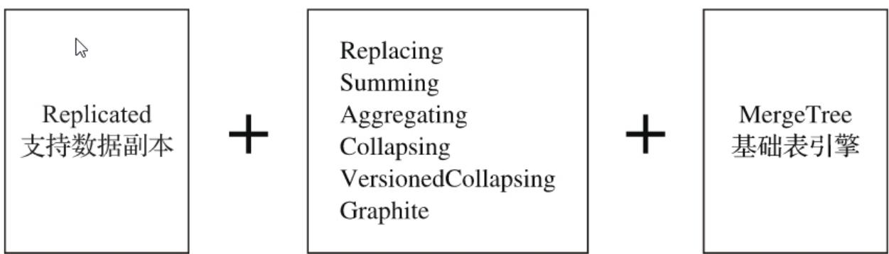
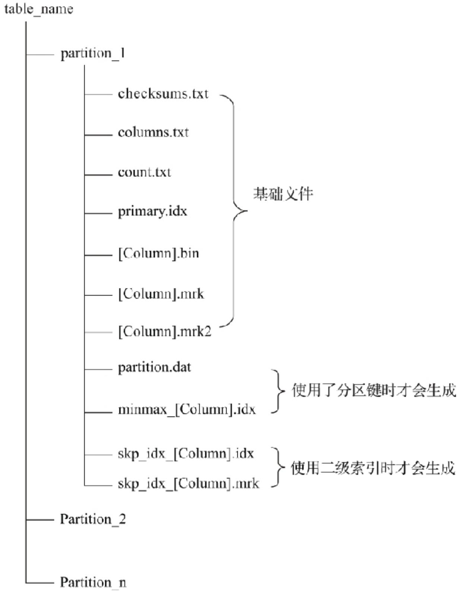

# MergeTree家族

表引擎是ClickHouse设计实现中的一大特色。可以说，是表引擎决定了一张数据表最终的“性格”，比如数据表拥有何种特性、数据以何种形式被存储以及如何被加载。ClickHouse拥有非常庞大的表引擎体系，其共拥有合并树、外部存储、内存、文件、接口和其他6大类20多种表引擎。而在这众多的表引擎中，又属合并树（MergeTree）表引擎及其家族系列（\*MergeTree）最为强大，在生产环境的绝大部分场景中，都会使用此系列的表引擎。因为只有合并树系列的表引擎才支持主键索引、数据分区、数据副本和数据采样这些特性，同时也只有此系列的表引擎支持ALTER相关操作。

合并树家族自身也拥有多种表引擎的变种。其中MergeTree作为家族中最基础的表引擎，提供了主键索引、数据分区、数据副本和数据采样等基本能力，而家族中其他的表引擎则在MergeTree的基础之上各有所长，例如：

ReplacingMergeTree表引擎具有删除重复数据的特性  
SummingMergeTree表引擎则会按照排序键自动聚合数据

如果给合并树系列的表引擎加上Replicated前缀，又会得到一组支持数据副本的表引擎，例如“ReplicatedMergeTree、ReplicatedReplacingMergeTree、ReplicatedSummingMergeTree等。



<details>
<summary>flowchart</summary>


</details>

虽然合并树的变种很多，但MergeTree表引擎才是根基。作为合并树家族系列中最基础的表引擎，MergeTree具备了该系列其他表引擎共有的基本特征，所以吃透了MergeTree表引擎的原理，就能够掌握该系列引擎的精髓。

# MergeTree的创建方式与存储结构

MergeTree在写入一批数据时，数据总会以数据片段的形式写入磁盘，且数据片段不可修改。为了避免片段过多，ClickHouse会通过后台线程，定期合并这些数据片段，属于相同分区的数据片段会被合成一个新的片段。这种数据片段往复合并的特点，也正是合并树名称的由来。

# MergeTree的创建方式

创建MergeTree数据表的方法，与定义数据表的方法大致相同，但需要将ENGINE参数声明为MergeTree()。

```sql
CREATE TABLE [IF NOT EXISTS] [db_name.]table_name (
    name1 [type] [DEFAULT|MATERIALIZED|ALIAS expr],
    name2 [type] [DEFAULT|MATERIALIZED|ALIAS expr],
    省略...
) ENGINE = MergeTree()
[PARTITION BY expr] 
```

```txt
[ORDER BY expr]
[PRIMARY KEY expr]
[SAMPLE BY expr]
[SETTINGS name=value, 省略...] 
```

MergeTree表引擎除了常规参数之外，还拥有一些独有的配置选项。接下来会着重介绍其中几个重要的参数，包括它们的使用方法和工作原理。

PARTITION BY [选填]：分区键，用于指定表数据以何种标准进行分区。

分区键既可以是单个列字段，也可以通过元组的形式使用多个列字段，同时它也支持使用列表达式。如果不声明分区键，则ClickHouse会生成一个名为all的分区。合理使用数据分区，可以有效减少查询时数据文件的扫描范围。

ORDER BY [必填]：排序键，用于指定在一个数据片段内，数据以何种标准排序。

默认情况下主键（PRIMARY KEY）与排序键相同。排序键既可以是单个列字段，例如ORDER BYCounterID，也可以通过元组的形式使用多个列字段，例如ORDER BY（CounterID,EventDate）。当使用多个列字段排序时，以ORDER BY（CounterID,EventDate）为例，在单个数据片段内，数据首先会以CounterID排序，相同CounterID的数据再按EventDate排序。

PRIMARY KEY [选填]：主键，顾名思义，声明后会依照主键字段生成一级索引，用于加速表查询。

默认情况下，主键与排序键(ORDER BY)相同，所以通常直接使用ORDER BY代为指定主键，无须刻意通过PRIMARY KEY声明。所以在一般情况下，在单个数据片段内，数据与一级索引以相同的规则升序排列。与其他数据库不同，MergeTree主键允许存在重复数据（ReplacingMergeTree可以去重）。

SAMPLE BY [选填]：抽样表达式，用于声明数据以何种标准进行采样。

如果使用了此配置项，那么在主键的配置中也需要声明同样的表达式，例如：

```txt
省略...
) ENGINE = MergeTree()
ORDER BY (CounterID, EventDate, intHash32(UserID)
SAMPLE BY intHash32(UserID) 
```

抽样表达式需要配合SAMPLE子查询使用，这项功能对于选取抽样数据十分有用。

SETTINGS：

```txt
省略...
）ENGINE = MergeTree()
省略...
SETTINGS index_granularity = 8192; 
```

index\_granularity [选填]：它表示索引的粒度，默认值为8192。也就是说，MergeTree的索引在默认情况下，每间隔8192行数据才生成一条索引。8192是一个神奇的数字，在ClickHouse中大量数值参数都有它的影子，可以被其整除（例如最小压缩块大小min\_compress\_block\_size:65536）。通常情况下并不需要修改此参数，但理解它的工作原理有助于我们更好地使用MergeTree。关于索引详细的工作原理会在后续阐述。

index\_granularity\_bytes [选填]：在19.11版本之前，ClickHouse只支持固定大小的索引间隔，由index\_granularity控制，默认为8192。在新版本中，它增加了自适应间隔大小的特性，即根据每一批次写入数据的体量大小，动态划分间隔大小。而数据的体量大小，正是由index\_granularity\_bytes参数控制的，默认为10M(10×1024×1024)，设置为0表示不启动自适应功能。  
enable\_mixed\_granularity\_parts [选填]：设置是否开启自适应索引间隔的功能，默认开启。  
merge\_with\_ttl\_timeout [选填]：从19.6版本开始，MergeTree提供了数据TTL的功能。  
storage\_policy [选填]：从19.15版本开始，MergeTree提供了多路径的存储策略。

# MergeTree的存储结构

MergeTree表引擎中的数据是拥有物理存储的，数据会按照分区目录的形式保存到磁盘之上。



<details>
<summary>flowchart</summary>

```mermaid
graph TD
    A["table_name"] --> B["partition_1"]
    B --> C["checksums.txt"]
    B --> D["columns.txt"]
    B --> E["count.txt"]
    B --> F["primary.idx"]
    B --> G["[Column"].bin]
    B --> H["[Column"].mrk]
    B --> I["[Column"].mrk2]
    B --> J["partition.dat"]
    J --> K["minmax_[Column"].idx]
    K --> L["skp_idx_[Column"].idx]
    K --> M["skp_idx_[Column"].mrk]
    L --> N["使用二级索引时才会生成"]
    M --> N
    B --> O["基础文件"]
    O --> P["Partition_2"]
    B --> Q["Partition_n"]
```
</details>

一张数据表的完整物理结构分为3个层级，依次是数据表目录、分区目录及各分区下具体的数据文件。接下来就逐一介绍它们的作用。

（1）partition：分区目录，余下各类数据文件（primary.idx、[Column].mrk、[Column].bin等）都是以分区目录的形式被组织存放的，属于相同分区的数据，最终会被合并到同一个分区目录，而不同分区的数据，永远不会被合并在一起。  
（2）checksums.txt：校验文件，使用二进制格式存储。它保存了余下各类文件(primary.idx、count.txt等)的size大小及size的哈希值，用于快速校验文件的完整性和正确性。

（3）columns.txt：列信息文件，使用明文格式存储。用于保存此数据分区下的列字段信息，

```txt
$ cat columns.txt
columns format version: 1
4 columns:
'ID' String
'URL' String
'Code' String
'EventTime' D 
```

（4）count.txt：计数文件，使用明文格式存储。用于记录当前数据分区目录下数据的总行数，例如：

```txt
$ cat count.txt
8 
```

（5）primary.idx：一级索引文件，使用二进制格式存储。用于存放稀疏索引，一张MergeTree表只能声明一次一级索引（通过ORDER BY或者PRIMARY KEY）。借助稀疏索引，在数据查询的时能够排除主键条件范围之外的数据文件，从而有效减少数据扫描范围，加速查询速度。

（6）[Column].bin：数据文件，使用压缩格式存储，默认为LZ4压缩格式，用于存储某一列的数据。由于MergeTree采用列式存储，所以每一个列字段都拥有独立的.bin数据文件，并以列字段名称命名（例如CounterID.bin、EventDate.bin等）。

（7）[Column].mrk：列字段标记文件，使用二进制格式存储。标记文件中保存了.bin文件中数据的偏移量信息。标记文件与稀疏索引对齐，又与.bin文件一一对应，所以MergeTree通过标记文件建立了primary.idx稀疏索引与.bin数据文件之间的映射关系。即首先通过稀疏索引（primary.idx）找到对应数据的偏移量信息（.mrk），再通过偏移量直接从.bin文件中读取数据。由于.mrk标记文件与.bin文件一一对应，所以MergeTree中的每个列字段都会拥有与其对应的.mrk标记文件（例如CounterID.mrk、EventDate.mrk等）。

（8）[Column].mrk2：如果使用了自适应大小的索引间隔，则标记文件会以.mrk2命名。它的工作原理和作用与.mrk标记文件相同。

（9）partition.dat与minmax\_[Column].idx：如果使用了分区键，例如PARTITION BYEventTime，则会额外生成partition.dat与minmax索引文件，它们均使用二进制格式存储。partition.dat用于保存当前分区下分区表达式最终生成的值；而minmax索引用于记录当前分区下分区字段对应原始数据的最小和最大值。例如EventTime字段对应的原始数据为2019-05-01、2019-05-05，分区表达式为PARTITION BY toYYYYMM(EventTime)。partition.dat中保存的值将会是2019-05，而minmax索引中保存的值将会是2019-05-012019-05-05。

在这些分区索引的作用下，进行数据查询时能够快速跳过不必要的数据分区目录，从而减少最终需要扫描的数据范围。

（10）skp\_idx\_[Column].idx与skp\_idx\_[Column].mrk：如果在建表语句中声明了二级索引，则会额外生成相应的二级索引与标记文件，它们同样也使用二进制存储。二级索引在ClickHouse中又称跳数索引，目前拥有minmax、set、ngrambf\_v1和tokenbf\_v1四种类型。这些索引的最终目标与一级稀疏索引相同，都是为了进一步减少所需扫描的数据范围，以加速整个查询过程。