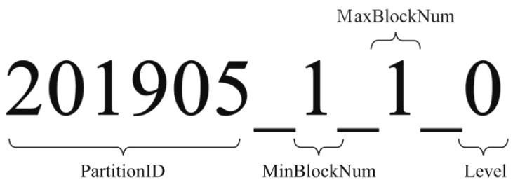
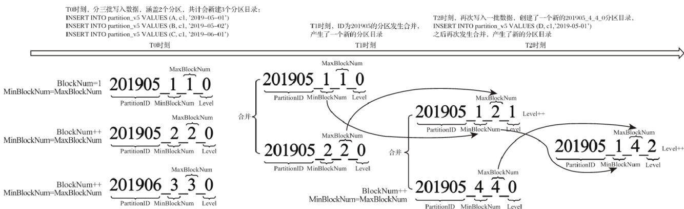
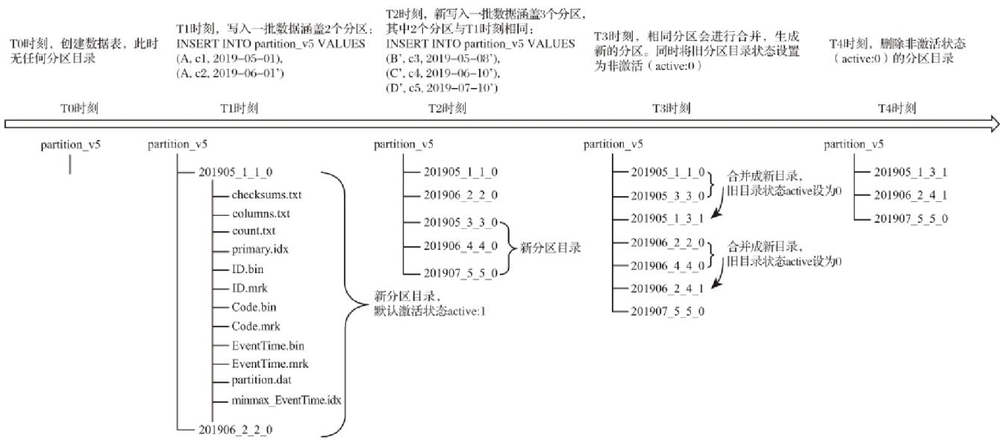

# 数据分区

# 数据的分区规则

```sql
CREATE TABLE partition_v1 (
    ID String,
    URL String,
    EventTime Date
) ENGINE = MergeTree()
PARTITION BY toYYYYMM(EventTime)
ORDER BY ID 
```

MergeTree数据分区的规则由分区ID决定，而具体到每个数据分区所对应的ID，则是由分区键的取值决定的。分区键支持使用任何一个或一组字段表达式声明，其业务语义可以是年、月、日或者组织单位等任何一种规则。针对取值数据类型的不同，分区ID的生成逻辑目前拥有四种规则：

（1）不指定分区键：如果不使用分区键，即不使用PARTITION BY声明任何分区表达式，则分区ID默认取名为all，所有的数据都会被写入这个all分区。  
（2）使用整型：如果分区键取值属于整型（兼容UInt64，包括有符号整型和无符号整型），且无法转换为日期类型YYYYMMDD格式，则直接按照该整型的字符形式输出，作为分区ID的取值。  
（3）使用日期类型：如果分区键取值属于日期类型，或者是能够转换为YYYYMMDD格式的整型，则使用按照YYYYMMDD进行格式化后的字符形式输出，并作为分区ID的取值。  
（4）使用其他类型：如果分区键取值既不属于整型，也不属于日期类型，例如String、Float等，则通过128位Hash算法取其Hash值作为分区ID的取值。

<table><tr><td>类型</td><td>样例数据</td><td>分区表达式</td><td>分区ID</td></tr><tr><td>无分区键</td><td></td><td>无</td><td>all</td></tr><tr><td rowspan="2">整型</td><td>18,19,20</td><td>PARTITION BY Age</td><td>分区1:18分区2:19分区3:20</td></tr><tr><td>‘A0’,‘A1’,‘A2’</td><td>PARTITION BY length(Code)</td><td>分区1:2</td></tr><tr><td rowspan="2">日期</td><td>2019-05-01, 2019-06-11</td><td>PARTITION BY EventTime</td><td>分区1:20190501分区2:20190611</td></tr><tr><td>2019-05-01, 2019-06-11</td><td>PARTITION BY toYYYYMM(EventTime)</td><td>分区1:201905分区2:201906</td></tr><tr><td>其他</td><td>‘www.nauu.com’</td><td>PARTITION BY URL</td><td>分区1:15b31467bc77fa1c24ac9380cd8b4033</td></tr></table>

如果通过元组的方式使用多个分区字段，则分区ID依旧是根据上述规则生成的，只是多个ID之间通过“-”符号依次拼接。例如按照上述表格中的例子，使用两个字段分区：

```txt
PARTITION BY (length(Code), EventTime) 
```

则最终的分区ID会是下面的模样：

```txt
2-20190501
2-20190611 
```

# 分区目录的命名规则

但是如果进入数据表所在的磁盘目录后，会发现MergeTree分区目录的完整物理名称并不是只有ID而已，在ID之后还跟着一串奇怪的数字，例如201905\_1\_1\_0。那么这些数字又代表着什么呢？

众所周知，对于MergeTree而言，它最核心的特点是其分区目录的合并动作。但是我们可曾想过，从分区目录的命名中便能够解读出它的合并逻辑。我们会着重对命名公式中各分项进行解读，一个完整分区目录的命名公式如下所示：

PartitionID\_MinBlockNum\_MaxBlockNum\_Level



<details>
<summary>text_image</summary>

201905_1_1_0
PartitionID
MinBlockNum
MaxBlockNum
Level
</details>

201905表示分区目录的ID；  
1\_1分别表示最小的数据块编号与最大的数据块编号；  
而最后的\_0则表示目前合并的层级。

接下来开始分别解释它们的含义：

（1）PartitionID：分区ID，无须多说。  
（2）MinBlockNum和MaxBlockNum：顾名思义，最小数据块编号与最大数据块编号。这里的BlockNum是一个整型的自增长编号。如果将其设为n的话，那么计数n在单张MergeTree数据表内全局累加，n从1开始，每当新创建一个分区目录时，计数n就会累积加1。对于一个新的分区目录而言，MinBlockNum与MaxBlockNum取值一样，同等于n，例如201905\_1\_1\_0、201906\_2\_2\_0以此类推。但是也有例外，当分区目录发生合并时，对于新产生的合并目录MinBlockNum与MaxBlockNum有着另外的取值规则。  
（3）Level：合并的层级，可以理解为某个分区被合并过的次数，或者这个分区的年龄。数值越高表示年龄越大。Level计数与BlockNum有所不同，它并不是全局累加的。对于每一个新创建的分区目录而言，其初始值均为0。之后，以分区为单位，如果相同分区发生合并动作，则在相应分区内计数累积加1。

# 分区目录的合并过程

MergeTree的分区目录和传统意义上其他数据库有所不同。首先，MergeTree的分区目录并不是在数据表被创建之后就存在的，而是在数据写入过程中被创建的。也就是说如果一张数据表没有任何数据，那么也不会有任何分区目录存在。其次，它的分区目录在建立之后也并不是一成不变的。在其他某些数据库的设计中，追加数据后目录自身不会发生变化，只是在相同分区目录中追加新的数据文件。而MergeTree完全不同，伴随着每一批数据的写入（一次INSERT语句），MergeTree都会生成一批新的分区目录。即便不同批次写入的数据属于相同分区，也会生成不同的分区目录。也就是说，对于同一个分区而言，也会存在多个分区目录的情况。在之后的某个时刻（写入后的10～15分钟，也可以手动执行optimize查询语句），ClickHouse会通过后台任务再将属于相同分区的多个目录合并成一个新的目录。已经存在的旧分区目录并不会立即被删除，而是在之后的某个时刻通过后台任务被删除（默认8分钟）。

属于同一个分区的多个目录，在合并之后会生成一个全新的目录，目录中的索引和数据文件也会相应地进行合并。新目录名称的合并方式遵循以下规则，其中：

MinBlockNum：取同一分区内所有目录中最小的MinBlockNum值。  
MaxBlockNum：取同一分区内所有目录中最大的MaxBlockNum值。  
Level：取同一分区内最大Level值并加1。



<details>
<summary>flowchart</summary>

Memory layout comparison flowchart showing partitioning and level generation across T0, T1, and T2 timeframes with block numbers and partition IDs
</details>

partition\_v5测试表按日期字段格式分区，即PARTITION BY toYYYYMM（EventTime），T表示时间。假设在T0时刻，首先分3批（3次INSERT语句）写入3条数据人：

INSERT INTO partition\_v5 VALUES (A, c1, '2019-05-01')

INSERT INTO partition\_v5 VALUES (B, c1, '2019-05-02')

INSERT INTO partition\_v5 VALUES (C, c1, '2019-06-01')

按照目录规，上述代码会创建3个分区目录。分区目录的名称由PartitionID、MinBlockNum、MaxBlockNum和Level组成，其中PartitionID根据6.2.1节介绍的生成规则，3个分区目录的ID依次为201905、201905和201906。而对于每个新建的分区目录而言，它们的MinBlockNum与MaxBlockNum取值相同，均来源于表内全局自增的BlockNum。BlockNum初始为1，每次新建目录后累计加1。所以，3个分区目录的MinBlockNum与MaxBlockNum依次为0\_0、1\_1和2\_2。最后是Level层级，每个新建的分区目录初始Level都是0。所以3个分区目录的最终名称分别是201905\_1\_1\_0、201905\_2\_2\_0和201906\_3\_3\_0。

假设在T1时刻，MergeTree的合并动作开始了，那么属于同一分区的201905\_1\_1\_0与201905\_2\_2\_0目录将发生合并。从图6-4所示过程中可以发现，合并动作完成后，生成了一个新的分区201905\_1\_2\_1。根据本节所述的合并规则，其中，MinBlockNum取同一分区内所有目录中最小的MinBlockNum值，所以是1；MaxBlockNum取同一分区内所有目录中最大的MaxBlockNum值，所以是2；而Level则取同一分区内，最大Level值加1，所以是1。而后续T2时刻的合并规则，只是在重复刚才所述的过程而已。

至此，大家已经知道了分区ID、目录命名和目录合并的相关规则。最后，再用一张完整的示例图作为总结，描述MergeTree分区目录从创建、合并到删除的整个过程.



分区目录在发生合并之后，旧的分区目录并没有被立即删除，而是会存留一段时间。但是旧的分区目录已不再是激活状态（active=0），所以在数据查询时，它们会被自动过滤掉。
