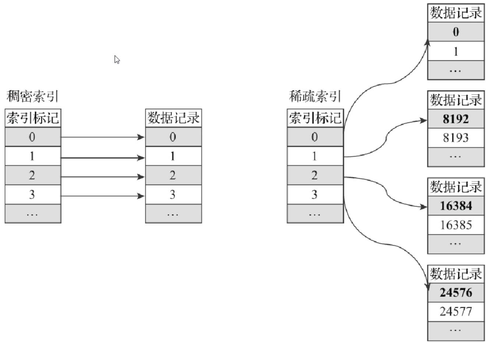
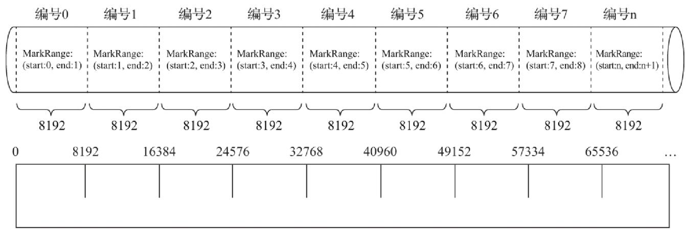
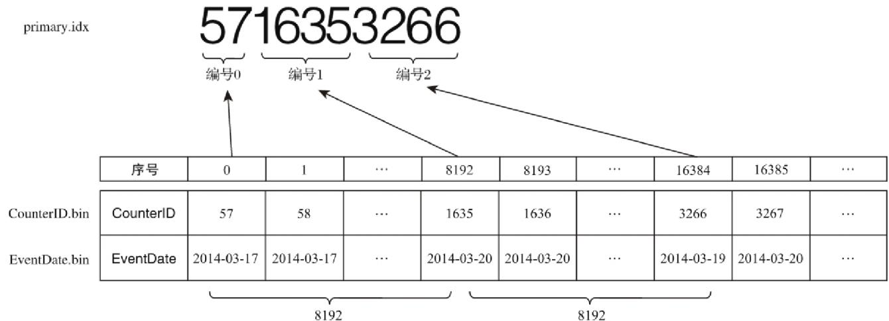
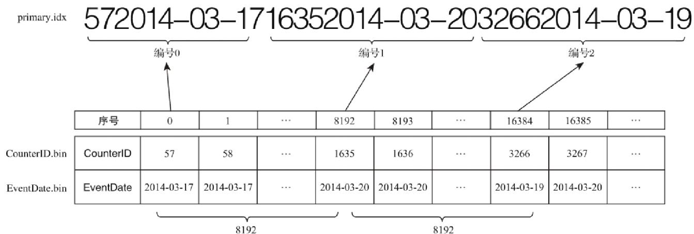
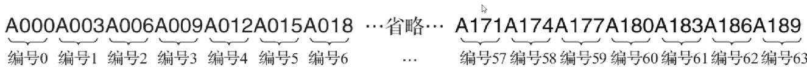
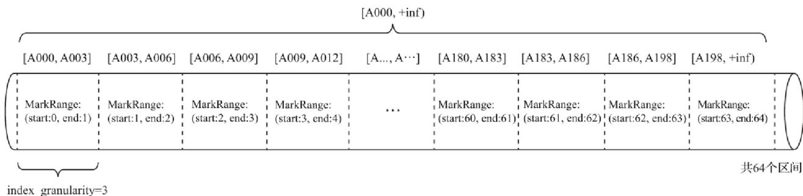
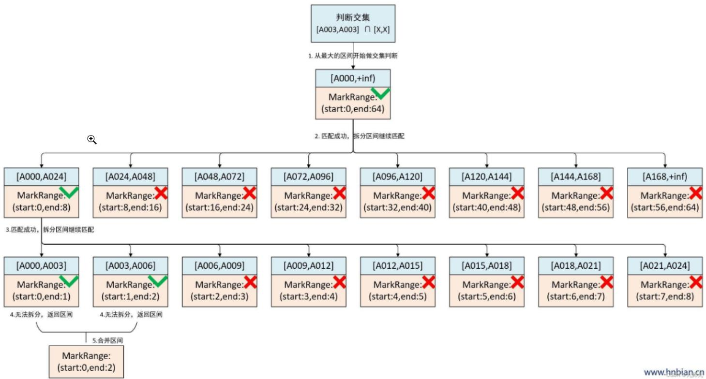

# 一级索引

MergeTree的主键使用PRIMARY KEY定义，待主键定义之后，MergeTree会依据index\_granularity间隔（默认8192行），为数据表生成一级索引并保存至primary.idx文件内，索引数据按照PRIMARYKEY排序。相比使用PRIMARY KEY定义，更为常见的简化形式是通过ORDER BY指代主键。在此种情形下，PRIMARY KEY与ORDER BY定义相同，所以索引（primary.idx）和数据（.bin）会按照完全相同的规则排序。对于PRIMARY KEY与ORDER BY定义有差异的应用场景在SummingMergeTree引擎部分会说到。

# 稀疏索引

primary.idx文件内的一级索引采用稀疏索引实现。此时有人可能会问，既然提到了稀疏索引，那么是不是也有稠密索引呢？



<details>
<summary>flowchart</summary>

数据索引结构对比图，展示稠密索引与稀疏索引的索引标记与数据记录的映射关系
</details>

简单来说，在稠密索引中每一行索引标记都会对应到一行具体的数据记录。而在稀疏索引中，每一行索引标记对应的是一段数据，而不是一行。用一个形象的例子来说明：如果把MergeTree比作一本书，那么稀疏索引就好比是这本书的一级章节目录。一级章节目录不会具体对应到每个字的位置，只会记录每个章节的起始页码。

稀疏索引的优势是显而易见的，它仅需使用少量的索引标记就能够记录大量数据的区间位置信息，且数据量越大优势越为明显。以默认的索引粒度（8192）为例，MergeTree只需要12208行索引标记就能为1亿行数据记录提供索引。由于稀疏索引占用空间小，所以primary.idx内的索引数据常驻内存，取用速度自然极快。

# 索引粒度

在先前的篇幅中已经数次出现过index\_granularity这个参数了，它表示索引的粒度。虽然在新版本中，ClickHouse提供了自适应粒度大小的特性，但是为了便于理解，仍然会使用固定的索引粒度（默认8192）进行讲解。索引粒度对MergeTree而言是一个非常重要的概念，因此很有必要对它做一番深入解读。索引粒度就如同标尺一般，会丈量整个数据的长度，并依照刻度对数据进行标注，最终将数据标记成多个间隔的小段。



数据以index\_granularity的粒度（默认8192）被标记成多个小的区间，其中每个区间最多8192行数据。MergeTree使用MarkRange表示一个具体的区间，并通过start和end表示其具体的范围。

index\_granularity的命名虽然取了索引二字，但它不单只作用于一级索引（.idx），同时也会影响数据标记（.mrk）和数据文件（.bin）。因为仅有一级索引自身是无法完成查询工作的，它需要借助数据标记才能定位数据，所以一级索引和数据标记的间隔粒度相同（同为index\_granularity行），彼此对齐。而数据文件也会依照index\_granularity的间隔粒度生成压缩数据块。

# 索引数据的生成规则

由于是稀疏索引，所以MergeTree需要间隔index\_granularity行数据才会生成一条索引记录，其索引值会依据声明的主键字段获取。测试表hits\_v1中的真实数据具象化后的效果。hits\_v1使用年月分区（PARTITION BY toYYYYMM(EventDate)），所以2014年3月份的数据最终会被划分到同一个分区目录内。如果使用CounterID作为主键（ORDER BY CounterID），则每间隔8192行数据就会取一次CounterID的值作为索引值，索引数据最终会被写入primary.idx文件进行保存。



<details>
<summary>text_image</summary>

primary.idx
5716353266
编号0 编号1 编号2
序号 0 1 ... 8192 8193 ... 16384 16385 ...
CounterID.bin CounterID 57 58 ... 1635 1636 ... 3266 3267 ...
EventDate.bin EventDate 2014-03-17 2014-03-17 ... 2014-03-20 2014-03-20 ... 2014-03-19 2014-03-20 ...
</details>

每间隔index\_granularity行数据，默认8192

第0(8192\*0)行CounterID取值57，第8192(8192\*1)行CounterID取值1635，而第16384(8192\*2)行CounterID取值3266，最终索引数据将会是5716353266。

MergeTree对于稀疏索引的存储是非常紧凑的，索引值前后相连，按照主键字段顺序紧密地排列在一起。不仅此处，ClickHouse中很多数据结构都被设计得非常紧凑，比如其使用位读取替代专门的标志位或状态码，可以不浪费哪怕一个字节的空间。以小见大，这也是ClickHouse为何性能如此出众的深层原因之一。

如果使用多个主键，例如ORDER BY(CounterID,EventDate)，则每间隔8192行可以同时取CounterID与EventDate两列的值作为索引值。



<details>
<summary>text_image</summary>

primary.idx 572014-03-17 16352014-03-20 32662014-03-19
编号0 编号1 编号2
序号 0 1 ... 8192 8193 ... 16384 16385 ...
CounterID.bin CounterID 57 58 ... 1635 1636 ... 3266 3267 ...
EventDate.bin EventDate 2014-03-17 2014-03-17 ... 2014-03-20 2014-03-20 ... 2014-03-19 2014-03-20 ...
</details>

每间隔index\_granularity行数据，默认8192

# 索引的查询过程

首先，我们需要了解什么是MarkRange。MarkRange在ClickHouse中是用于定义标记区间的对象。通过先前的介绍已知，MergeTree按照index\_granularity的间隔粒度，将一段完整的数据划分成了多个小的间隔数据段，一个具体的数据段即是一个MarkRange。MarkRange与索引编号对应，使用start和end两个属性表示其区间范围。通过与start及end对应的索引编号的取值，即能够得到它所对应的数值区间。而数值区间表示了此MarkRange包含的数据范围。

假如现在有一份测试数据，共192行记录。其中，主键ID为String类型，ID的取值从A000开始，后面依次为A001、A002……直至A192为止。MergeTree的索引粒度index\_granularity=3，根据索引的生成规则，primary.idx文件内的索引数据如下所示。

primary.idx的物理存储




根据索引数据，MergeTree会将此数据片段划分成192/3=64个小的MarkRange，两个相邻MarkRange相距的步长为1。其中，所有MarkRange（整个数据片段）的最大数值区间为[A000,+inf)



<details>
<summary>text_image</summary>

[A000, +inf]
[A000, A003] [A003, A006] [A006, A009] [A009, A012] [A..., A...] [A180, A183] [A183, A186] [A186, A198] [A198, +inf]
MarkRange:
(start:0, end:1) MarkRange:
(start:1, end:2) MarkRange:
(start:2, end:3) MarkRange:
(start:3, end:4) ... MarkRange:
(start:60, end:61) MarkRange:
(start:61, end:62) MarkRange:
(start:62, end:63) MarkRange:
(start:63, end:64)
index_granularity=3 共64个区间
</details>

在引出了数值区间的概念之后，对于索引的查询过程就很好解释了。索引查询其实就是两个数值区间的交集判断。其中，一个区间是由基于主键的查询条件转换而来的条件区间；而另一个区间是刚才所讲述的与MarkRange对应的数值区间。

整个索引查询过程可以大致分为3个步骤。

（1）生成查询条件区间：首先，将查询条件转换为条件区间。即便是单个值的查询条件，也会被转换成区间的形式，例如下面的例子：

```sql
WHERE ID = 'A003'
['A003', 'A003']

WHERE ID > 'A000'
('A000', +inf)

WHERE ID < 'A188'
(-inf, 'A188')

WHERE ID LIKE 'A006%'
['A006', 'A007')
```

（2）递归交集判断：以递归的形式，依次对MarkRange的数值区间与条件区间做交集判断。从最大的区间[A000,+inf)开始：

如果不存在交集，则直接通过剪枝算法优化此整段MarkRange。  
如果存在交集，且MarkRange步长大于8(end-start)，则将此区间进一步拆分成8个子区间（由merge\_tree\_coarse\_index\_granularity指定，默认值为8），并重复此规则，继续做递归交集判断。  
如果存在交集，且MarkRange不可再分解（步长小于8），则记录MarkRange并返回。

（3）合并MarkRange区间：将最终匹配的MarkRange聚在一起，合并它们的范围。

MergeTree通过递归的形式持续向下拆分区间，最终将MarkRange定位到最细的粒度，以帮助在后续读取数据的时候，能够最小化扫描数据的范围。以下图为例，当查询条件WHERE ID='A003'的时候，最终只需要读取[A000,A003]和[A003,A006]两个区间的数据,它们对应MarkRange(start:0,end:2)范围，而其他无用的区间都被裁剪掉了。因为MarkRange转换的数值区间是闭区间，所以会额外匹配到临近的一个区间。



<details>
<summary>flowchart</summary>

Network transaction decision tree covering MarkRange operations and success rates, with branches for success, completion, and return zones.
</details>