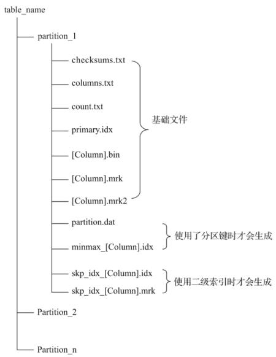
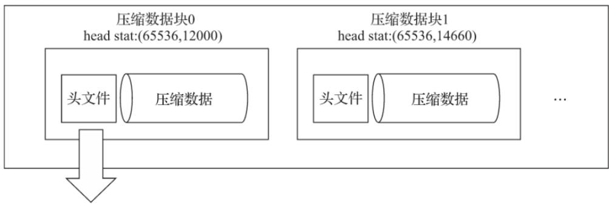
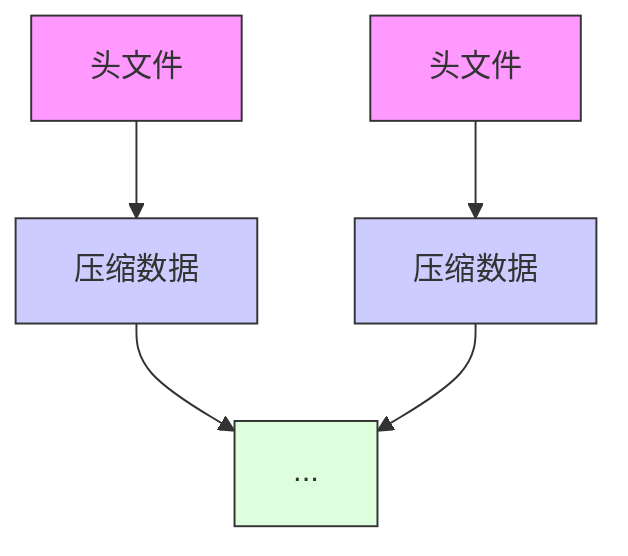
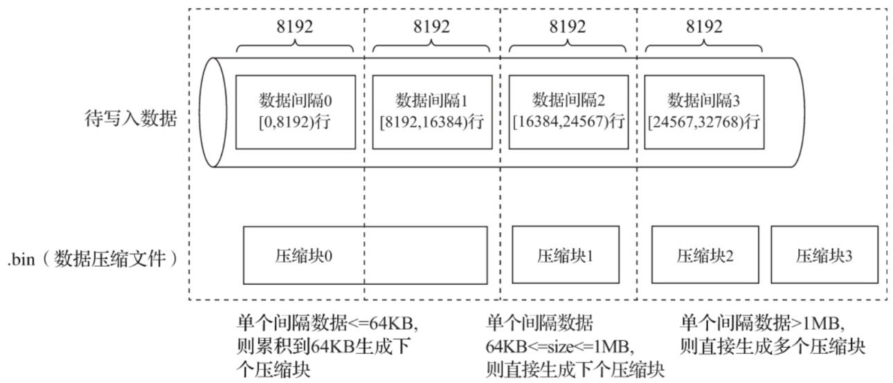
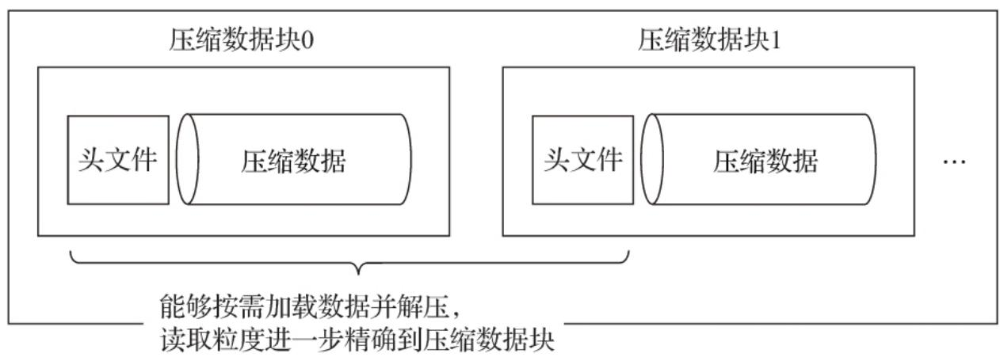
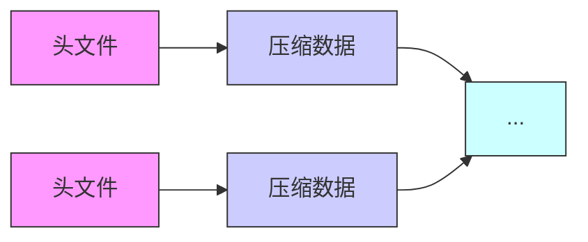

# 各列独立存储

在MergeTree中，数据按列存储。而具体到每个列字段，数据也是独立存储的，每个列字段都拥有一个与之对应的.bin数据文件。



<details>
<summary>flowchart</summary>

```mermaid
graph TD
    A["table_name"] --> B["partition_1"]
    B --> C["checksums.txt"]
    C --> D["columns.txt"]
    D --> E["count.txt"]
    E --> F["primary.idx"]
    F --> G["[Column"].bin]
    G --> H["[Column"].mrk]
    H --> I["[Column"].mrk2]
    I --> J["partition.dat"]
    J --> K["minmax_[Column"].idx]
    K --> L["skp_idx_[Column"].idx]
    L --> M["skp_idx_[Column"].mrk]
    M --> N["Partition_2"]
    N --> O["Partition_n"]
    C --> P["基础文件"]
    J --> Q["使用了分区键时才会生成"]
    L --> R["使用二级索引时才会生成"]
```
</details>

也正是这些.bin文件，最终承载着数据的物理存储。数据文件以分区目录的形式被组织存放，所以在.bin文件中只会保存当前分区片段内的这一部分数据。

按列独立存储的设计优势显而易见：

一是可以更好地进行数据压缩（相同类型的数据放在一起，对压缩更加友好）

二是能够最小化数据扫描的范围。

而对应到存储的具体实现方面，MergeTree也并不是一股脑地将数据直接写入.bin文件，而是经过了一番精心设计：

首先，数据是经过压缩的，目前支持LZ4、ZSTD、Multiple和Delta几种算法，默认使用LZ4算法；

其次，数据会事先依照ORDER BY的声明排序；

最后，数据是以压缩数据块的形式被组织并写入.bin文件中的。

压缩数据块就好比一本书的文字段落，是组织文字的基本单元。这个概念十分重要，值得多花些篇幅进一步展开说明。

# 压缩数据块

一个压缩数据块由头信息和压缩数据两部分组成。头信息固定使用9位字节表示，具体由1个UInt8（1字节）整型和2个UInt32（4字节）整型组成，分别代表使用的压缩算法类型、压缩后的数据大小和压缩前的数据大小。

JavaEnable.bin



<details>
<summary>flowchart</summary>


</details>

0x821200065536   


<details>
<summary>natural_image</summary>

Pure diagram of three horizontal lines with arrows pointing outward from each other (no text or symbols)
</details>

CompressionMethod\_CompressedSize\_UncompressedSize

压缩方法

Type: Ulnt8, Size: 1 Byte

数据压缩后字节大小

Type: Ulnt32,Size:4Byte

数据压缩前字节大小

Type: Ulnt32, Size: 4 Byte

ZSTD:0x90

Multiple : 0x91

Delta: 0x92

.bin压缩文件是由多个压缩数据块组成的，而每个压缩数据块的头信息则是基于

CompressionMethod\_CompressedSize\_UncompressedSize公式生成的。

通过ClickHouse提供的clickhouse-compressor工具，能够查询某个.bin文件中压缩数据的统计信息。以测试数据集hits\_v1为例，执行下面的命令：

clickhouse-compressor --stat < /chbase/ /data/default/hits\_v1/201403\_1\_34\_3/JavaEnable.bi

执行后，会看到如下信息：

65536 12000

65536 14661

65536 4936

65536 7506

省略…

其中每一行数据代表着一个压缩数据块的头信息，其分别表示该压缩块中未压缩数据大小和压缩后数据大小（打印信息与物理存储的顺序刚好相反）。

每个压缩数据块的体积，按照其压缩前的数据字节大小，都被严格控制在64KB～1MB，其上下限分别由min\_compress\_block\_size（默认65536）与max\_compress\_block\_size（默认1048576）参数指定。而一个压缩数据块最终的大小，则和索引粒度（index\_granularity 8192）内数据的实际大小相关。

MergeTree在数据具体的写入过程中，会依照索引粒度（默认情况下，每次取8192行），按批次获取数据并进行处理。如果把一批数据的未压缩大小设为size，则整个写入过程遵循以下规则：

（1）单个批次数据size<64KB：如果单个批次数据小于64KB，则继续获取下一批数据，直至累积到size>=64KB时，生成下一个压缩数据块。  
（2）单个批次数据64KB<=size<=1MB：如果单个批次数据大小恰好在64KB与1MB之间，则直接生成下一个压缩数据块。  
（3）单个批次数据size>1MB：如果单个批次数据直接超过1MB，则首先按照1MB大小截断并生成下一个压缩数据块。剩余数据继续依照上述规则执行。此时，会出现一个批次数据生成多个压缩数据块的情况。



<details>
<summary>text_image</summary>

待写入数据
8192
8192
8192
8192
数据间隔0
[0,8192)行
数据间隔1
[8192,16384)行
数据间隔2
[16384,24567)行
数据间隔3
[24567,32768)行
. bin（数据压缩文件）
压缩块0
压缩块1
压缩块2
压缩块3
单个间隔数据<=64KB,
则累积到64KB生成下
个压缩块
单个间隔数据
64KB<=size<=1MB,
则直接生成下个压缩块
单个间隔数据>1MB,
则直接生成多个压缩块
</details>

经过上述的介绍后我们知道，一个.bin文件是由1至多个压缩数据块组成的，每个压缩块大小在64KB～1MB之间。多个压缩数据块之间，按照写入顺序首尾相接，紧密地排列在一起。

在.bin文件中引入压缩数据块的目的至少有以下两个：

其一，虽然数据被压缩后能够有效减少数据大小，降低存储空间并加速数据传输效率，但数据的压缩和解压动作，其本身也会带来额外的性能损耗。所以需要控制被压缩数据的大小，以求在性能损耗和压缩率之间寻求一种平衡。

其二，在具体读取某一列数据时（.bin文件），首先需要将压缩数据加载到内存并解压，这样才能进行后续的数据处理。通过压缩数据块，可以在不读取整个.bin文件的情况下将读取粒度降低到压缩数据块级别，从而进一步缩小数据读取的范围。

[Column].bin



<details>
<summary>flowchart</summary>


</details>