# OLAP常见架构分类

OLAP领域技术发展至今方兴未艾，分析型数据库百花齐放。然而，看似手上拥有很多筹码的架构师们，有时候却面临无牌可打的窘境，这又是为何呢？为了回答这个问题，我们需要重温一下什么是OLAP，以及实现OLAP的几种常见思路。

之前说过，OLAP名为联机分析，又可以称为多维分析，是由关系型数据库之父埃德加·科德（EdgarFrank Codd）于1993年提出的概念。顾名思义，它指的是通过多种不同的维度审视数据，进行深层次分析。维度可以看作观察数据的一种视角，例如人类能看到的世界是三维的，它包含长、宽、高三个维度。直接一点理解，维度就好比是一张数据表的字段，而多维分析则是基于这些字段进行聚合查询。

那么多维分析通常都包含哪些基本操作呢？为了更好地理解多维分析的概念，可以使用一个立方体的图像具象化操作，对于一张销售明细表，数据立方体可以进行如下操作：

<table><tr><td>省</td><td>市</td><td>商品</td><td>时间</td><td>价格</td></tr><tr><td>湖北</td><td>武汉</td><td>足球</td><td>2019.1</td><td>100</td></tr><tr><td>湖北</td><td>武汉</td><td>篮球</td><td>2019.2</td><td>140</td></tr><tr><td>湖北</td><td>宜昌</td><td>篮球</td><td>2019.2</td><td>150</td></tr><tr><td>广东</td><td>广州</td><td>乒乓球</td><td>2019.5</td><td>5</td></tr><tr><td>广东</td><td>珠海</td><td>羽毛球</td><td>2019.8</td><td>9</td></tr><tr><td>广东</td><td>珠海</td><td>羽毛球</td><td>2019.9</td><td>10</td></tr><tr><td>广东</td><td>珠海</td><td>足球</td><td>2019.1</td><td>110</td></tr><tr><td>广东</td><td>广州</td><td>足球</td><td>2019.5</td><td>120</td></tr></table>

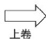

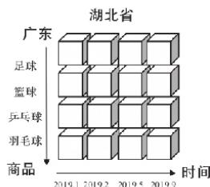

text_image

湖北省
广东
足球
篮球
乒乓球
羽毛球
商品
2019.1 2019.2 2019.5 2019.9
时间

销售明细表  
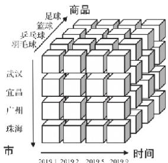

text_image

足球
篮球
乒乓球
羽毛球
商品
武汉
宜昌
广州
珠海
市
2019.1 2019.2 2019.5 2019.9
时间

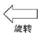

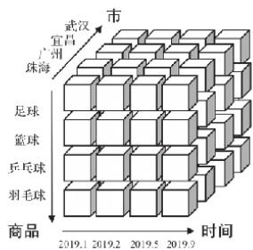

text_image

市
武汉
宜昌
广州
珠海
足球
篮球
乒乓球
羽毛球
商品
2019.1 2019.2 2019.5 2019.9
时间

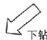

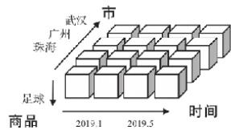

text_image

市
武汉
广州
珠海
足球
商品
时间
2019.1
2019.5

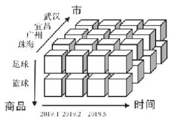

flowchart

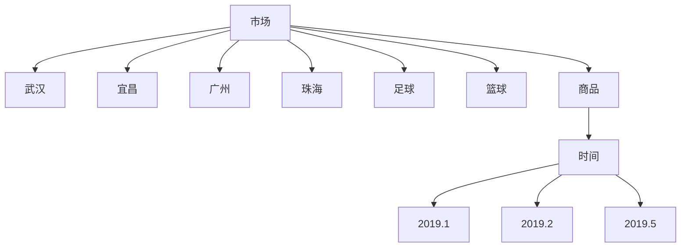

下钻：从高层次向低层次明细数据穿透。例如从“省”下钻到“市”，从“湖北省”穿透到“武汉”和“宜昌”。  
上卷：和下钻相反，从低层次向高层次汇聚。例如从“市”汇聚成“省”，将“武汉”“宜昌”汇聚成“湖北”。  
切片：观察立方体的一层，将一个或多个维度设为单个固定值，然后观察剩余的维度，例如将商品维度固定为“足球”。  
切块：与切片类似，只是将单个固定值变成多个值。例如将商品维度固定成“足球”“篮球”和“乒乓球”。  
旋转：旋转立方体的一面，如果要将数据映射到一张二维表，那么就要进行旋转，这就等同于行列置换。

为了实现上述这些操作，将常见的OLAP架构大致分成三类。

# ROLAP

第一类架构称为ROLAP（Relational OLAP，关系型OLAP）。顾名思义，它直接使用关系模型构建，数据模型常使用星型模型或者雪花模型。这是最先能够想到，也是最为直接的实现方法。因为OLAP概念在最初提出的时候，就是建立在关系型数据库之上的。多维分析的操作，可以直接转换成SQL查询。例如，通过上卷操作查看省份的销售额，就可以转换成类似下面的SQL语句：

但是这种架构对数据的实时处理能力要求很高。试想一下，如果对一张存有上亿行数据的数据表同时执行数十个字段的GROUP BY查询，将会发生什么事情？

# MOLAP

第二类架构称为MOLAP（Multidimensional OLAP，多维型OLAP）。它的出现是为了缓解ROLAP性能问题。MOLAP使用多维数组的形式保存数据，其核心思想是借助预先聚合结果，使用空间换取时间的形式最终提升查询性能。也就是说，用更多的存储空间换得查询时间的减少。其具体的实现方式是依托立方体模型的概念。

首先，对需要分析的数据进行建模，框定需要分析的维度字段；  
然后，通过预处理的形式，对各种维度进行组合并事先聚合；  
最后，将聚合结果以某种索引或者缓存的形式保存起来（通常只保留聚合后的结果，不存储明细数据）。

这样一来，在随后的查询过程中，就可以直接利用结果返回数据。但是这种架构也并不完美。维度预处理可能会导致数据的膨胀。这里可以做一次简单的计算，

<table><tr><td>省</td><td>市</td><td>商品</td><td>时间</td><td>价格</td></tr><tr><td>湖北</td><td>武汉</td><td>足球</td><td>2019.1</td><td>100</td></tr><tr><td>湖北</td><td>武汉</td><td>篮球</td><td>2019.2</td><td>140</td></tr><tr><td>湖北</td><td>宜昌</td><td>篮球</td><td>2019.2</td><td>150</td></tr><tr><td>广东</td><td>广州</td><td>乒乓球</td><td>2019.5</td><td>5</td></tr><tr><td>广东</td><td>珠海</td><td>羽毛球</td><td>2019.8</td><td>9</td></tr><tr><td>广东</td><td>珠海</td><td>羽毛球</td><td>2019.9</td><td>10</td></tr><tr><td>广东</td><td>珠海</td><td>足球</td><td>2019.1</td><td>110</td></tr><tr><td>广东</td><td>广州</td><td>足球</td><td>2019.5</td><td>120</td></tr></table>

  
销售明细表

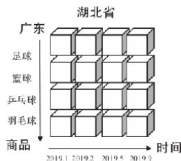

text_image

湖北省
广东
足球
篮球
乒乓球
羽毛球
商品
2019.1 2019.2 2019.5 2019.9
时间

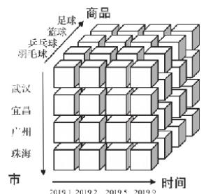

text_image

足球
篮球
乒乓球
羽毛球
商品
武汉
宜昌
广州
珠海
市
时间
2019.1 2019.2 2019.5 2019.3

text_image

市
武汉
宜昌
广州
珠海
足球
篮球
乒乓球
羽毛球
商品
2019.1 2019.2 2019.5 2019.9
时间

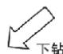

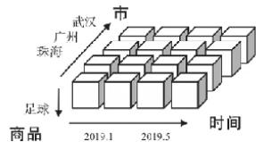

text_image

市
武汉
广州
珠海
足球
商品
时间
2019.1
2019.5

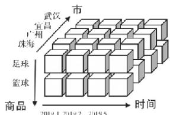

text_image

市
武汉
宜昌
广州
珠海
足球
篮球
商品
时间
2019.1 2019.2 2019.5

销售明细表为例。如果数据立方体包含了5个维度（字段），那么维度组合的方式则有25（2n，n=维度个数）个。例如，省和市两个维度的组合就有<湖北，武汉>、<湖北、宜昌>、<武汉、湖北>、<宜昌、湖北>等。可想而知，当维度数据基数较高的时候，（高基数意味着重复相同的数据少。）其立方体预聚合后的数据量可能会达到10到20倍的膨胀。一张千万级别的数据表，就有可能膨胀到亿级别的体量。人们意识到这个问题之后，虽然也实现了一些能够降低膨胀率的优化手段，但并不能完全避免。另外，由于使用了预处理的形式，数据立方体会有一定的滞后性，不能实时进行数据分析。而且，立方体只保留了聚合后的结果数据，导致无法查询明细数据。

第三类架构称为HOLAP（Hybrid OLAP，混合架构的OLAP）。这种思路可以理解成ROLAP和MOLAP两者的集成。这里不再展开，我们重点关注ROLAP和MOLAP。

# OLAP实现技术的演进

在介绍了OLAP几种主要的架构之后，再来看看它们背后技术的演进过程。我把这个演进过程简单划分成两个阶段。

第一个可以称为传统关系型数据库阶段。在这个阶段中，OLAP主要基于以Oracle、MySQL为代表的一众关系型数据实现。在ROLAP架构下，直接使用这些数据库作为存储与计算的载体；在MOLAP架构下，则借助物化视图的形式实现数据立方体。在这个时期，不论是ROLAP还是MOLAP，在数据体量大、维度数目多的情况下都存在严重的性能问题，甚至存在根本查询不出结果的情况。

第二个可以称为大数据技术阶段。由于大数据处理技术的普及，人们开始使用大数据技术重构ROLAP和MOLAP。以ROLAP架构为例，传统关系型数据库就被Hive和SparkSQL这类新兴技术所取代。虽然，以Spark为代表的分布式计算系统，相比Oracle这类传统数据库而言，在面向海量数据的处理性能方面已经优秀很多，但是直接把它们作为面向终端用户的在线查询系统还是太慢了。我们的用户普遍缺乏耐心，如果一个查询响应需要几十秒甚至数分钟才能返回，那么这套方案就完全行不通。再看MOLAP架构，MOLAP背后也转为依托MapReduce或Spark这类新兴技术，将其作为立方体的计算引擎，加速立方体的构建过程。其预聚合结果的存储载体也转向HBase这类高性能分布式数据库。大数据技术阶段，主流MOLAP架构已经能够在亿万级数据的体量下，实现毫秒级的查询响应时间。尽管如此，MOLAP架构依然存在维度爆炸、数据同步实时性不高的问题。

不难发现，虽然OLAP在经历了大数据技术的洗礼之后，其各方面性能已经有了脱胎换骨式的改观，但不论是ROLAP还是MOLAP，仍然存在各自的痛点。

如果单纯从模型角度考虑，很明显ROLAP架构更胜一筹。因为关系模型拥有最好的“群众基础”，也更简单且容易理解。它直接面向明细数据查询，由于不需要预处理，也就自然没有预处理带来的负面影响（维度组合爆炸、数据实时性、更新问题）。那是否存在这样一种技术，它既使用ROLAP模型，同时又拥有比肩MOLAP的性能呢？