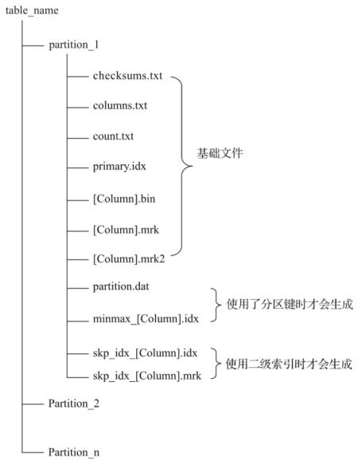
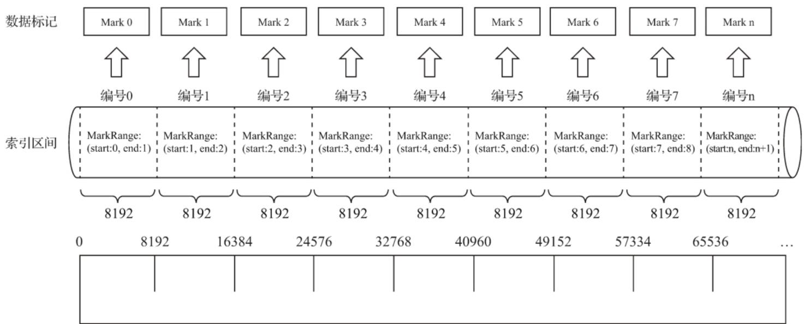
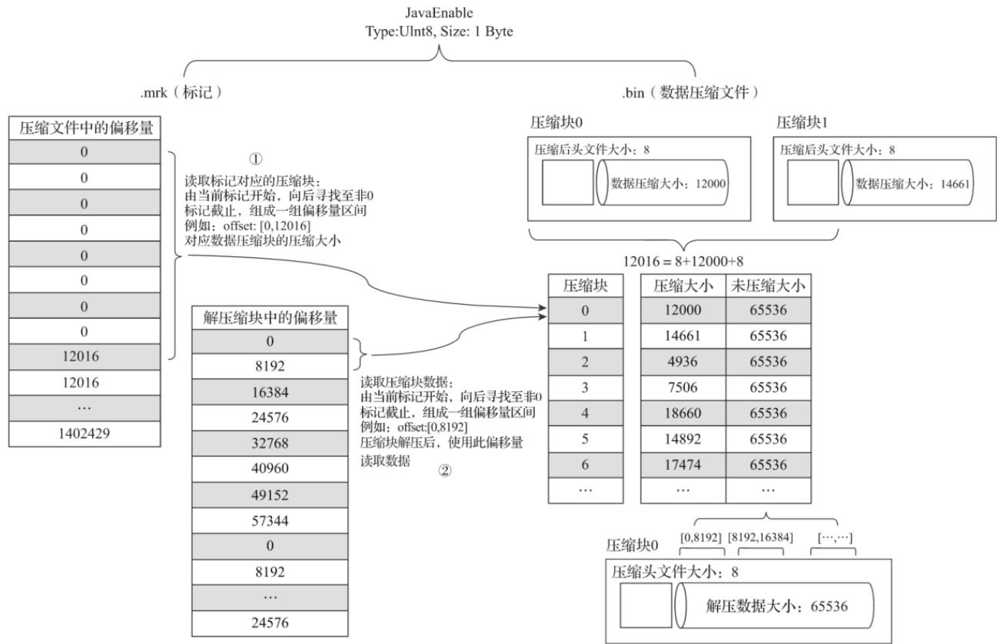

# 数据标记

如果把MergeTree比作一本书，primary.idx一级索引好比这本书的一级章节目录，.bin文件中的数据好比这本书中的文字，那么数据标记(.mrk)会为一级章节目录和具体的文字之间建立关联。对于数据标记而言，它记录了两点重要信息：

其一，是一级章节对应的页码信息；

其二，是一段文字在某一页中的起始位置信息。这样一来，通过数据标记就能够很快地从一本书中立即翻到关注内容所在的那一页，并知道从第几行开始阅读。



<details>
<summary>flowchart</summary>

```mermaid
graph TD
    A["partition_1"] --> B["checksums.txt"]
    A --> C["columns.txt"]
    A --> D["count.txt"]
    A --> E["primary.idx"]
    A --> F["[Column"].bin]
    A --> G["[Column"].mrk]
    A --> H["[Column"].mrk2]
    A --> I["partition.dat"]
    I --> J["minmax_[Column"].idx]
    I --> K["skp_idx_[Column"].idx]
    I --> L["skp_idx_[Column"].mrk]
    A --> M["Partition_2"]
    A --> N["Partition_n"]
    B --> O["基础文件"]
    J --> P["使用了分区键时才会生成"]
    K --> Q["使用二级索引时才会生成"]
```
</details>

# 数据标记的生成规则

数据标记作为衔接一级索引和数据的桥梁，其像极了做过标记小抄的书签，而且书本中每个一级章节都拥有各自的书签。



即数据标记和索引区间是对齐的，均按照index\_granularity的粒度间隔。如此一来，只需简单通过索引区间的下标编号就可以直接找到对应的数据标记。

为了能够与数据衔接，数据标记文件也与.bin文件一一对应。即每一个列字段[Column].bin文件都有一个与之对应的[Column].mrk数据标记文件，用于记录数据在.bin文件中的偏移量信息。

一行标记数据使用一个元组表示，元组内包含两个整型数值的偏移量信息。它们分别表示在此段数据区间内，在对应的.bin压缩文件中，压缩数据块的起始偏移量；以及将该数据压缩块解压后，其未压缩数据的起始偏移量。

数据标记和索引区间是对齐的，均按照index\_granularity的粒度间隔。如此一来，只需简单通过索引区间的下标编号就可以直接找到对应的数据标记。

.mrk（标记）

<table><tr><td>编号</td><td>压缩文件中的偏移量</td><td>解压缩块中的偏移量</td></tr><tr><td>0</td><td>0</td><td>0</td></tr><tr><td>1</td><td>0</td><td>8192</td></tr><tr><td>2</td><td>0</td><td>16384</td></tr><tr><td>3</td><td>0</td><td>24576</td></tr><tr><td>4</td><td>0</td><td>32768</td></tr><tr><td>5</td><td>0</td><td>40960</td></tr><tr><td>6</td><td>0</td><td>49152</td></tr><tr><td>7</td><td>0</td><td>57344</td></tr><tr><td>8</td><td>12016</td><td>0</td></tr><tr><td>9</td><td>12016</td><td>8192</td></tr><tr><td>...</td><td>...</td><td>...</td></tr></table>

每一行标记数据都表示了一个片段的数据（默认8192行）在.bin压缩文件中的读取位置信息。标记数据与一级索引数据不同，它并不能常驻内存，而是使用LRU（最近最少使用）缓存策略加快其取用速度。

# 数据标记的工作方式

MergeTree在读取数据时，必须通过标记数据的位置信息才能够找到所需要的数据。整个查找过程大致可以分为读取压缩数据块和读取数据两个步骤。



<details>
<summary>text_image</summary>

JavaEnable
Type:UInt8, Size: 1 Byte
.mrk（标记）
.bin（数据压缩文件）
压缩文件中的偏移量
0
0
0
0
0
0
0
0
0
12016
12016
...
1402429
①
读取标记对应的压缩块：
由当前标记开始，向后寻找至非0
标记截止，组成一组偏移量区间
例如：offset: [0,12016]
对应数据压缩块的压缩大小
解压缩块中的偏移量
0
8192
16384
24576
32768
40960
49152
57344
0
8192
...
24576
读取压缩块数据：
由当前标记开始，向后寻找至非0
标记截止，组成一组偏移量区间
例如：offset: [0,8192]
压缩块解压后，使用此偏移量
读取数据
②
压缩块
0
1
2
3
4
5
6
...
压缩大小
12000
65536
14661
65536
4936
65536
7506
65536
18660
65536
14892
65536
17474
65536
...
压缩块0
[0,8192]
[8192,16384]
[...]
压缩头文件大小: 8
解压数据大小: 65536
</details>

首先，左侧的标记数据做一番解释说明。JavaEnable字段的数据类型为UInt8，所以每行数值占用1字节。而hits\_v1数据表的index\_granularity粒度为8192，所以一个索引片段的数据大小恰好是8192B。

按压缩数据块的生成规则，如果单个批次数据小于64KB，则继续获取下一批数据，直至累积到size>=64KB时，生成下一个压缩数据块。因此在JavaEnable的标记文件中，每8行标记数据对应1个压缩数据块（ $( 1 8 ^ { \star } 8 1 9 2 = 8 1 9 2 8 , 6 4 \mathsf { K } 8 = 6 5 5 3 6 8 , 6 5 5 3 6 / 8 1 9 2 = 8 )$ ）。所以能够看到，其左侧的标记数据中，8行数据的压缩文件偏移量都是相同的，因为这8行标记都指向了同一个压缩数据块。而在这8行的标记数据中，它们的解压缩数据块中的偏移量，则依次按照8192B（每行数据1B，每一个批次8192行数据）累加，当累加达到65536(64KB)时则置0。因为根据规则，此时会生成下一个压缩数据块。理解了上述标记数据之后，接下来就开始介绍MergeTree具体是如何定位压缩数据块并读取数据的。

（1）读取压缩数据块：在查询某一列数据时，MergeTree无须一次性加载整个.bin文件，而是可以根据需要，只加载特定的压缩数据块。而这项特性需要借助标记文件中所保存的压缩文件中的偏移量。如图所示的标记数据中，上下相邻的两个压缩文件中的起始偏移量，构成了与获取当前标记对应的压缩数据块的偏移量区间。由当前标记数据开始，向下寻找，直到找到不同的压缩文件偏移量为止。此时得到的一组偏移量区间即是压缩数据块在.bin文件中的偏移量。例如图中所示中，读取右侧.bin文件中[0，12016]字节数据，就能获取第0个压缩数据块。

在.mrk文件中，第0个压缩数据块的截止偏移量是12016。而在.bin数据文件中，第0个压缩数据块的压缩大小是12000。为什么两个数值不同呢？其实原因很简单，12000只是数据压缩后的字节数，并没有包含头信息部分。而一个完整的压缩数据块是由头信息加上压缩数据组成的，它的头信息固定由9个字节组成，压缩后大小为8个字节。所以，12016=8+12000+8，其定位方法如图6-19右上角所示。压缩数据块被整个加载到内存之后，会进行解压，在这之后就进入具体数据的读取环节了。

（2）读取数据：在读取解压后的数据时，MergeTree并不需要一次性扫描整段解压数据，它可以根据需要，以index\_granularity的粒度加载特定的一小段。为了实现这项特性，需要借助标记文件中保存的解压数据块中的偏移量。

同样的，在标记数据中，上下相邻两个解压缩数据块中的起始偏移量，构成了与获取当前标记对应的数据的偏移量区间。通过这个区间，能够在它的压缩块被解压之后，依照偏移量按需读取数据。例如在图6-19所示中，通过[0，8192]能够读取压缩数据块0中的第一个数据片段。