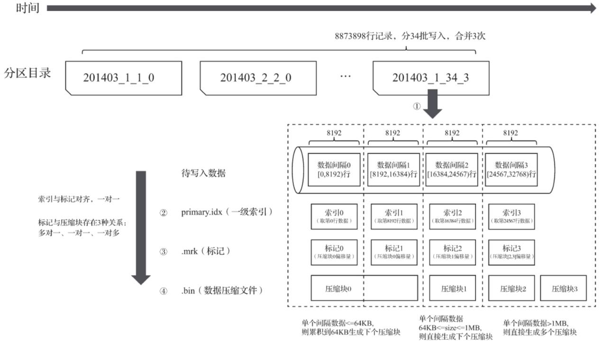
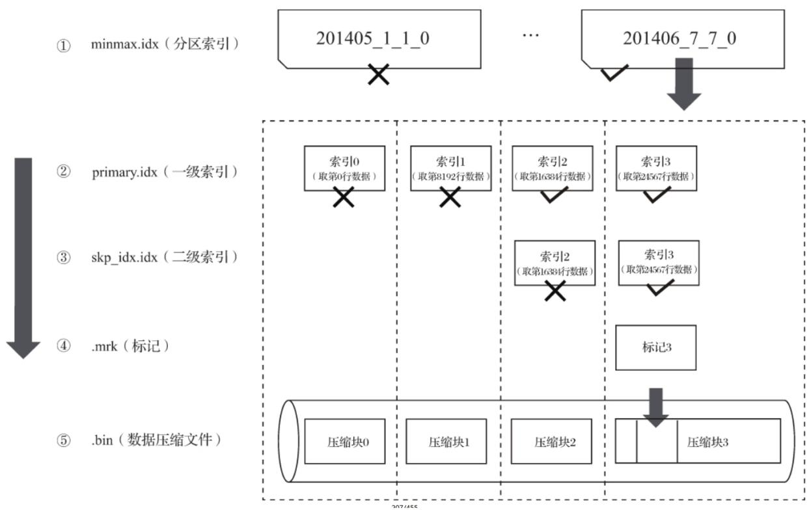
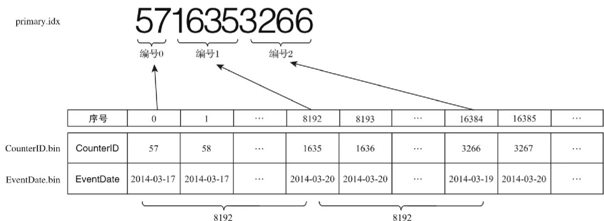
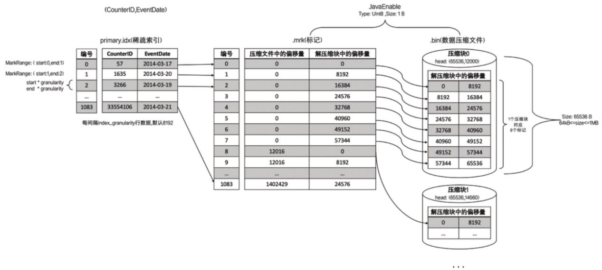
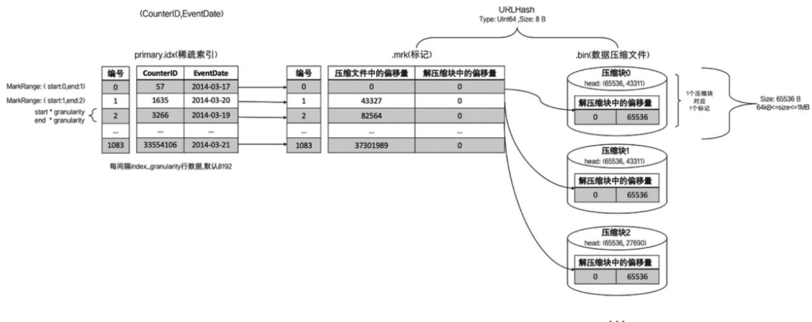
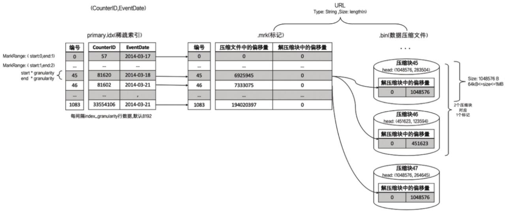

# 对于分区、索引、标记和压缩数据的协同总结

分区、索引、标记和压缩数据，就好比是MergeTree给出的一套组合拳，使用恰当时威力无穷。那么，在依次介绍了各自的特点之后，现在将它们聚在一块进行一番总结。接下来，就分别从写入过程、查询过程，以及数据标记与压缩数据块的三种对应关系的角度展开介绍。

# 写入过程

数据写入的第一步是生成分区目录，伴随着每一批数据的写入，都会生成一个新的分区目录。在后续的某一时刻，属于相同分区的目录会依照规则合并到一起；接着，按照index\_granularity索引粒度，会分别生成primary.idx一级索引（如果声明了二级索引，还会创建二级索引文件）、每一个列字段的.mrk数据标记和.bin压缩数据文件。下图说明MergeTree表在写入数据时，它的分区目录、索引、标记和压缩数据的生成过程。



<details>
<summary>flowchart</summary>

```mermaid
graph TD
    A["分区目录"] --> B["201403_1_1_0"]
    A --> C["201403_2_2_0"]
    A --> D["..."]
    A --> E["201403_1_34_3"]
    E --> F["①"]
    F --> G["数据间隔0[0,8192"]行]
    F --> H["数据间隔1[8192,16384"]行]
    F --> I["数据间隔2[16384,24567"]行]
    F --> J["数据间隔3[24567,32768"]行]
    G --> K["索引0(取第0行数据)"]
    H --> L["索引1(取第8192行数据)"]
    I --> M["索引2(取第16384行数据)"]
    J --> N["索引3(取第24567行数据)"]
    K --> O["标记0(压缩块0偏移量)"]
    L --> P["标记1(压缩块0偏移量)"]
    M --> Q["标记2(压缩块1偏移量)"]
    N --> R["标记3(压缩块[2.3"]偏移量)]
    O --> S["压缩块0"]
    P --> T["压缩块1"]
    Q --> U["压缩块2"]
    R --> V["压缩块3"]
    G --> W["待写入数据"]
    H --> W
    I --> W
    J --> W
    K --> X["索引与标记对齐，一对一"]
    L --> X
    M --> X
    N --> X
    O --> Y["标记与压缩块存在3种关系：多对一、一对一、一对多"]
    P --> Y
    Q --> Y
    R --> Y
    S --> Z["单个间隔数据<=64KB,则累积到64KB生成下个压缩块"]
    T --> AA["单个间隔数据64KB<=size<=1MB,则直接生成下个压缩块"]
    U --> AB["单个间隔数据>1MB,则直接生成多个压缩块"]
```
</details>

从分区目录201403\_1\_34\_3能够得知，该分区数据共分34批写入，期间发生过3次合并。在数据写入的过程中，依据index\_granularity的粒度，依次为每个区间的数据生成索引、标记和压缩数据块。其中，索引和标记区间是对齐的，而标记与压缩块则根据区间数据大小的不同，会生成多对一、一对一和一对多三种关系。

# 查询过程

数据查询的本质，可以看作一个不断减小数据范围的过程。在最理想的情况下，MergeTree首先可以依次借助分区索引、一级索引和二级索引，将数据扫描范围缩至最小。然后再借助数据标记，将需要解压与计算的数据范围缩至最小。下图为例它示意了在最优的情况下，经过层层过滤，最终获取最小范围数据的过程。



<details>
<summary>flowchart</summary>

数据压缩流程图，展示minmax、primary、skp、mrk和.bin文件的分区索引、一级、二级、标记及压缩块执行过程
</details>



<details>
<summary>text_image</summary>

primary.idx
5716353266
编号0 编号1 编号2
序号 0 1 ... 8192 8193 ... 16384 16385 ...
CounterID.bin CounterID 57 58 ... 1635 1636 ... 3266 3267 ...
EventDate.bin EventDate 2014-03-17 2014-03-17 ... 2014-03-20 2014-03-20 ... 2014-03-19 2014-03-20 ...
</details>

每间隔index\_granularity行数据，默认8192

如果一条查询语句没有指定任何WHERE条件，或是指定了WHERE条件，但条件没有匹配到任何索引（分区索引、一级索引和二级索引），那么MergeTree就不能预先减小数据范围。在后续进行数据查询时，它会扫描所有分区目录，以及目录内索引段的最大区间。虽然不能减少数据范围，但是MergeTree仍然能够借助数据标记，以多线程的形式同时读取多个压缩数据块，以提升性能。

# 数据标记与压缩数据块的对应关系

由于压缩数据块的划分，与一个间隔（index\_granularity）内的数据大小相关，每个压缩数据块的体积都被严格控制在64KB～1MB。而一个间隔（index\_granularity）的数据，又只会产生一行数据标记。那么根据一个间隔内数据的实际字节大小，数据标记和压缩数据块之间会产生三种不同的对应关系。接下来使用具体示例做进一步说明，对于示例数据，仍然是测试表hits\_v1，其中index\_granularity粒度为8192，数据总量为8873898行。

# 多对一

多个数据标记对应一个压缩数据块，当一个间隔（index\_granularity）内的数据未压缩大小size小于64KB时，会出现这种对应关系。

以hits\_v1测试表的JavaEnable字段为例。JavaEnable数据类型为UInt8，大小为1B，则一个间隔内数据大小为8192B。所以在此种情形下，每8个数据标记会对应同一个压缩数据块，如图所示。



<details>
<summary>flowchart</summary>

Java内存结构流程图，展示main Idx数据经编译、编码、压缩文件与解压缩块的映射关系，以及压缩块的子结构
</details>

# 一对一

一个数据标记对应一个压缩数据块，当一个间隔（index\_granularity）内的数据未压缩大小size大于等于64KB且小于等于1MB时，会出现这种对应关系。

以hits\_v1测试表的URLHash字段为例。URLHash数据类型为UInt64，大小为8B，则一个间隔内数据大小为65536B，恰好等于64KB。所以在此种情形下，数据标记与压缩数据块是一对一的关系，如图所示。



<details>
<summary>flowchart</summary>

数据库压缩流程图，展示从index级到数据级的编译过程，包含压缩文件、解压缩块和数据压缩文件的映射关系
</details>

# 一对多

一个数据标记对应多个压缩数据块，当一个间隔（index\_granularity）内的数据未压缩大小size直接大于1MB时，会出现这种对应关系。

以hits\_v1测试表的URL字段为例。URL数据类型为String，大小根据实际内容而定。如图所示，编号45的标记对应了2个压缩数据块。



<details>
<summary>flowchart</summary>

文件压缩流程图，展示从index级到数据级的编译过程，包含压缩文件、偏移量和压缩块等关键节点
</details>