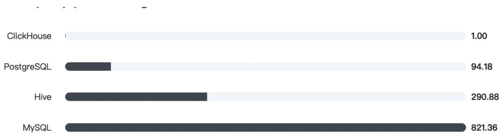

# 初识ClickHouse

以Spark为代表的新一代ROLAP方案虽然可以一站式处理海量数据，但无法真正做到实时应答和高并发，它更适合作为一个后端的查询系统。而新一代的MOLAP方案虽然解决了大部分查询性能的瓶颈问题，能够做到实时应答，但数据膨胀和预处理等问题依然没有被很好解决。除了上述两类方案之外，也有一种另辟蹊径的选择，即摒弃ROLAP和MOLAP转而使用搜索引擎来实现OLAP查询，ElasticSearch是这类方案的代表。ElasticSearch支持实时更新，在百万级别数据的场景下可以做到实时聚合查询，但是随着数据体量的继续增大，它的查询性能也将捉襟见肘。

ClickHouse对我而言极为特殊，

# 其具有

ROLAP   
在线实时查询  
完整的DBMS   
列式存储  
不需要任何数据预处理  
支持批量更新  
拥有非常完善的SQL支持和函数  
支持高可用  
不依赖Hadoop复杂生态  
开箱即用等许多特点。

特别是它那夸张的查询性能，我想大多数刚接触ClickHouse的人也一定会因为它的性能指标而动容。在一系列官方公布的基准测试对比中，ClickHouse都遥遥领先对手，这其中不乏一些我们耳熟能详的名字。

所有用于对比的数据库都使用了相同配置的服务器，在单个节点的情况下，对一张拥有133个字段的数据表分别在1000万、1亿和10亿三种数据体量下执行基准测试，基准测试的范围涵盖43项SQL查询。在1亿数据集体量的情况下，ClickHouse的平均响应速度是Vertica的2.63倍、InfiniDB的17倍、MonetDB的27倍、Hive的126倍、MySQL的429倍以及Greenplum的10倍。详细的测试结果可以查阅https://benchmark.clickhouse.com/。

text_image

clickhouse.com/benchmark/dbms/#[100... 
已暂停
应用 百度 翻译 学习 架构技术 xdclass.net 电商运营 大课训练营 店铺 阿里云 内容 小滴课堂 阅读清单

# Performance comparison of analytical DBMS

# Compare

# Dataset size

bar

| Database | Value |
| :--- | :--- |
| ClickHouse | 1.00 |
| PostgreSQL | 94.18 |
| Hive | 290.88 |
| MySQL | 821.36 |

Full results 

<table><tr><td>✓ Query</td><td>ClickHouse (19.1.6)</td><td>Hive (0.11, ORC File)</td><td>MySQL (5.5.32, MyISAM)</td><td>PostgreSQL (13)</td></tr><tr><td>✓ SELECT count() FROM hits</td><td>×1.60 (0.016 s.)</td><td>×10513.00 (105.130 s.)</td><td>(0.010 s.)</td><td>×506.00 (5.060 s.)</td></tr><tr><td>✓ SELECT count() FROM hits WHERE AdvEn</td><td>(0.012 s.)</td><td>×3036.25 (36.435 s.)</td><td>×19526.67 (234.320 s.)</td><td>×673.25 (8.079 s.)</td></tr><tr><td>✓ SELECT sum(AdvEngineID), count(), avg(Re</td><td>(0.041 s.)</td><td>×857.15 (35.143 s.)</td><td>×4836.83 (198.310 s.)</td><td>×201.85 (8.276 s.)</td></tr><tr><td>✓ SELECT sum(UserID) FROM hits</td><td>(0.047 s.)</td><td>×726.19 (34.131 s.)</td><td>×4055.11 (190.590 s.)</td><td>×145.43 (6.835 s.)</td></tr><tr><td>✓ SELECT uniq(UserID) FROM hits</td><td>(0.104 s.)</td><td>×1018.78 (105.953 s.)</td><td>×2411.92 (250.840 s.)</td><td>×725.01 (75.401 s.)</td></tr><tr><td>✓ SELECT uniq(SearchPhrase) FROM hits</td><td>(0.223 s.)</td><td>×284.35 (64.831 s.)</td><td>×1114.65 (254.140 s.)</td><td>×801.41 (182.721 s.)</td></tr><tr><td>✓ SELECT min(EventDate), max(EventDate) F</td><td>(0.043 s.)</td><td>×687.94 (33.021 s.)</td><td>×1585.63 (76.110 s.)</td><td>×136.29 (6.542 s.)</td></tr><tr><td>✓ SELECT AdvEngineID, count() FROM hits V</td><td>(0.012 s.)</td><td>×4271.75 (51.261 s.)</td><td>×15345.00 (184.140 s.)</td><td>×698.00 (8.376 s.)</td></tr><tr><td>✓ SELECT RegionID, uniq(UserID) AS u FROM</td><td>(0.509 s.)</td><td>×167.12 (85.062 s.)</td><td>×496.11 (252.520 s.)</td><td>×115.05 (58.559 s.)</td></tr><tr><td>✓ SELECT RegionID, sum(AdvEngineID), count</td><td>(0.542 s.)</td><td>×189.81 (102.879 s.)</td><td>×520.33 (282.020 s.)</td><td>×107.81 (58.435 s.)</td></tr><tr><td>✓ SELECT MobilePhoneModel, uniq(UserID) A</td><td>(0.171 s.)</td><td>×312.85 (53.498 s.)</td><td>×1155.03 (197.510 s.)</td><td>×65.51 (11.203 s.)</td></tr><tr><td>✓ SELECT MobilePhone, MobilePhoneModel,</td><td>(0.188 s.)</td><td>×285.63 (53.698 s.)</td><td>×1048.78 (197.170 s.)</td><td>×61.71 (11.602 s.)</td></tr><tr><td>✓ SELECT SearchPhrase, count() AS c FROM</td><td>(0.059 s.)</td><td>×125.95 (82.999 s.)</td><td>×1319.79 (869.740 s.)</td><td>×62.99 (41.510 s.)</td></tr><tr><td>✓ SELECT SearchPhrase, uniq(UserID) AS u f</td><td>(0.012 s.)</td><td>×107.13 (86.991 s.)</td><td>—</td><td>×58.35 (47.379 s.)</td></tr><tr><td>✓ SELECT SearchEngineID, SearchPhrase, cc</td><td>(0.734 s.)</td><td>×118.89 (87.267 s.)</td><td>—</td><td>×56.78 (41.674 s.)</td></tr><tr><td>✓ SELECT UserID, count() FROM hits GROUP BY</td><td>(0.723 s.)</td><td>×181.74 (132.306 s.)</td><td>—</td><td>×64.18 (46.721 s.)</td></tr><tr><td>✓ SELECT UserID, SearchPhrase, count() FR</td><td>(1.766 s.)</td><td>×83.75 (147.059 s.)</td><td>—</td><td>×141.53 (248.535 s.)</td></tr><tr><td>✓ SELECT UserID, SearchPhrase, count() FR</td><td>(1.033 s.)</td><td>×55.54 (57.376 s.)</td><td>—</td><td>×14.46 (14.939 s.)</td></tr><tr><td>✓ SELECT UserID, toMinute(EventTime) AS n</td><td>(4.030 s.)</td><td>×58.15 (234.361 s.)</td><td>—</td><td>×39.03 (157.307 s.)</td></tr><tr><td>✓ SELECT UserID FROM hits WHERE UserID</td><td>(0.074 s.)</td><td>×295.05 (21.834 s.)</td><td>×2690.41 (199.090 s.)</td><td>×86.64 (6.411 s.)</td></tr><tr><td>✓ SELECT count() FROM hits WHERE URL LI</td><td>(0.532 s.)</td><td>×68.50 (36.443 s.)</td><td>×369.79 (196.730 s.)</td><td>×16.61 (8.836 s.)</td></tr><tr><td>✓ SELECT SearchPhrase, any(URL), count() A</td><td>(0.645 s.)</td><td>×85.10 (54.888 s.)</td><td>×319.21 (205.890 s.)</td><td>×15.87 (10.236 s.)</td></tr><tr><td>✓ SELECT SearchPhrase, any(URL), any(Title</td><td>(1.478 s.)</td><td>×39.89 (58.995 s.)</td><td>×146.82 (217.150 s.)</td><td>×14.74 (21.797 s.)</td></tr><tr><td>✓ SELECT * FROM hits WHERE URL LIKE '%</td><td>(0.750 s.)</td><td>×116.63 (88.521 s.)</td><td>×272.42 (206.770 s.)</td><td>×11.50 (8.728 s.)</td></tr><tr><td>✓ SELECT SearchPhrase FROM hits WHERE</td><td>(0.239 s.)</td><td>×211.68 (50.592 s.)</td><td>×781.59 (186.800 s.)</td><td>×35.00 (8.366 s.)</td></tr></table>

# ClickHouse发展历程

ClickHouse背后的研发团队是来自俄罗斯的Yandex公司。这是一家俄罗斯本土的互联网企业，于2011年在纳斯达克上市，它的核心产品是搜索引擎。根据最新的数据显示，Yandex占据了本国47%以上的搜索市场，是现今世界上最大的俄语搜索引擎。Google是它的直接竞争对手。

众所周知，在线搜索引擎的营收来源非常依赖流量和在线广告业务。所以，通常搜索引擎公司为了更好地帮助自身及用户分析网络流量，都会推出自家的在线流量分析产品，例如Google的GoogleAnalytics、百度的百度统计。Yandex也不例外，Yandex.Metrica就是这样一款用于在线流量分析的产品（https://metrica.yandex.com）。

ClickHouse就是在这样的产品背景下诞生的，伴随着Yandex.Metrica业务的发展，其底层架构历经四个阶段，一步一步最终形成了大家现在所看到的ClickHouse。纵观这四个阶段的发展，俨然是数据分析产品形态以及OLAP架构历史演进的缩影。通过了解这段演进过程，我们能够更透彻地了解OLAP面对的挑战，以及ClickHouse能够解决的问题。

# MySQL阶段

作为一款在线流量分析产品，对其功能的要求自然是分析流量了。早期的Yandex.Metrica以提供固定报表的形式帮助用户进行分析，例如分析访问者使用的设备、访问者来源的分布之类。其实这也是早期分析类产品的典型特征之一，分析维度和场景是固定的，新的分析需求往往需要IT人员参与。

从技术角度来看，当时还处于关系型数据库称霸的时期，所以Yandex在内部其他产品中使用了MySQL数据库作为统计信息系统的底层存储软件。Yandex.Metrica的第一版架构顺理成章延续了这套内部稳定成熟的MySQL方案，并将其作为它的数据存储和分析引擎的解决方案。

因为Yandex内部的这套MySQL方案使用了MyISAM表引擎，所以Yandex.Metrica也延续了表引擎的选择。这类分析场景更关注数据写入和查询的性能，不关心事务操作（MyISAM表引擎不支持事务特性）。相比InnoDB表引擎，MyISAM表引擎在分析场景中具有更好的性能。

业内有一个常识性的认知，按顺序存储的数据会拥有更高的查询性能。因为读取顺序文件会用更少的磁盘寻道和旋转延迟时间（这里主要指机械磁盘），同时顺序读取也能利用操作系统层面文件缓存的预读功能，所以数据库的查询性能与数据在物理磁盘上的存储顺序息息相关。然而这套MySQL方案无法做到顺序存储。

MyISAM表引擎使用B+树结构存储索引，而数据则使用另外单独的存储文件（InnoDB表引擎使用B+树同时存储索引和数据，数据直接挂载在叶子节点中）。如果只考虑单线程的写入场景，并且在写入过程中不涉及数据删除或者更新操作，那么数据会依次按照写入的顺序被写入文件并落至磁盘。然而现实的场景不可能如此简单。

流量的数据采集链路是这样的：网站端的应用程序首先通过Yandex提供的站点SDK实时采集数据并发送到远端的接收系统，再由接收系统将数据写入MySQL集群。整个过程都是实时进行的，并且数据接收系统是一个分布式系统，所以它们会并行、随机将数据写入MySQL集群。这最终导致了数据在磁盘中是完全随机存储的，并且会产生大量的磁盘碎片。

市面上一块典型的7200转SATA磁盘的IOPS（每秒能处理的请求数）仅为100左右，也就是说每秒只能执行100次随机读取。假设一次随机读取返回10行数据，那么查询100000行记录则需要至少100秒，这种响应时间显然是不可接受的。

RAID可以提高磁盘IOPS性能，但并不能解决根本问题。SSD随机读取性能很高，但是考虑到硬件成本和集群规模，不可能全部采取SSD存储。

随着时间的推移，MySQL中的数据越来越多（截至2011年，存储的数据超过5800亿行）。虽然Yandex又额外做了许多优化，成功地将90%的分析报告控制在26秒内返回，但是这套技术方案越来越显得力不从心。

# 另辟蹊径的Metrage时期

由于MySQL带来的局限性，Yandex自研了一套全新的系统并命名为Metrage。Metrage在设计上与MySQL完全不同，它选择了另外一条截然不同的道路。首先，在数据模型层面，它使用Key-Value模型（键值对）代替了关系模型；其次，在索引层面，它使用LSM树代替了B+树；最后，在数据处理层面，由实时查询的方式改为了预处理的方式。

LSM树也是一种非常流行的索引结构，发源于Google的Big Table，现在最具代表性的使用LSM树索引结构的系统是HBase。LSM本质上可以看作将原本的一棵大树拆成了许多棵小树，每一批次写入的数据都会经历如下过程。

首先，会在内存中构建出一棵小树，构建完毕即算写入成功（这里会通过预写日志的形式，防止因内存故障而导致的数据丢失）。写入动作只发生在内存中，不涉及磁盘操作，所以极大地提升了数据写入性能。

其次，小树在构建的过程中会进行排序，这样就保证了数据的有序性。

最后，当内存中小树的数量达到某个阈值时，就会借助后台线程将小树刷入磁盘并生成一个小的数据段。在每个数据段中，数据局部有序。也正因为数据有序，所以能够进一步使用稀疏索引来优化查询性能。

借助LSM树索引，可使得Metrage引擎在软硬件层面同时得到优化（磁盘顺序读取、预读缓存、稀疏索引等），最终有效提高系统的综合性能。

如果仅拥有索引结构的优化，还不足以从根本上解决性能问题。Metrage设计的第二个重大转变是通过预处理的方式，将需要分析的数据预先聚合。这种做法类似数据立方体的思想，首先对分析的具体场景实施立方体建模，框定所需的维度和度量以形成数据立方体；接着预先计算立方体内的所有维度组合；最后将聚合的结果数据按照Key-Value的形式存储。这样一来，对于固定分析场景，就可以直接利用数据立方体的聚合结果立即返回相关数据。这套系统的实现思路和现今的一些MOLAP系统如出一辙。

通过上述一系列的转变，Metrage为Yandex.Metrica的性能带来了革命性提升。截至2015年，在Metrage内存储了超过3万亿行的数据，其集群规模超过了60台服务器，查询性能也由先前的26秒降低到了惊人的1秒以内。然而，使用立方体这类预先聚合的思路会带来一个新的问题，那就是维度组合爆炸，因为需要预先对所有的维度组合进行计算。那么维度组合的方式具体有多少种呢？它的计算公式是2^N（N=维度数量）。可以做一次简单的计算，例如5个维度的组合方式会有2^5-32种，而9个维度的组合方式则会多达2^9=512种，这是一种指数级的增长方式。维度组合的爆炸会直接导致数据膨胀，有时候这种膨胀可能会多达10～20倍。

# 自我突破的OLAPServer时期

如果说Metrage系统是弥补Yandex.Metrica性能瓶颈的产物，那么OLAPServer系统的诞生，则是产品形态升级倒逼的结果。在Yandex.Metrica的产品初期，它只支持固定报表的分析功能。随着时间的推移，这种固定化的分析形式早已不能满足用户的诉求，于是Yandex.Metrica计划推出自定义分析报告的功能。然而Metrage系统却无法满足这类自定义的分析场景，因为它需要预先聚合，并且只提供了内置的40多种固定分析场景。单独为每一个用户提供面向个人的预聚合功能显然是不切实际的。在这种背景下，Yandex.Metrica的研发团队只有寻求自我突破，于是自主研发了OLAPServer系统。

OLAPServer系统被设计成专门处理自定义报告这类临时性分析需求的系统，与Metrage系统形成互补的关系。结合之前两个阶段的建设经验，OLAPServer在设计思路上可以说是取众家之长。在数据模型方面，它又换回了关系模型，因为相比Key-Value模型，关系模型拥有更好的描述能力。使用SQL作为查询语言，也将会拥有更好的“群众基础”。而在存储结构和索引方面，它结合了MyISAM和LSM树最精华的部分。在存储结构上，它与MyISAM表引擎类似，分为了索引文件和数据文件两个部分。在索引方面，它并没有完全沿用LSM树，而是使用了LSM树所使用到的稀疏索引。在数据文件的设计上，则沿用了LSM树中数据段的思想，即数据段内数据有序，借助稀疏索引定位数据段。在有了上述基础之后，OLAPServer又进一步引入了列式存储的思想，将索引文件和数据文件按照列字段的粒度进行了拆分，每个列字段各自独立存储，以此进一步减少数据读取的范围。

虽然OLAPServer在实时聚合方面的性能相比MySQL有了质的飞跃，但从功能的完备性角度来看，OLAPServer还是差了一个量级。如果说MySQL可以称为数据库管理系统（DBMS），那么OLAPServer只能称为数据库。因为OLAPServer的定位只是和Metrage形成互补，所以它缺失了一些基本的功能。例如，它只有一种数据类型，即固定长度的数值类型，且没有DBMS应有的基本管理功能（DDL查询等）。

# 水到渠成的ClickHouse时代

现在，一个新的选择题摆在了Yandex.Metrica研发团队的面前，实时聚合还是预先聚合？预先聚合方案在查询性能方面带来了质的提升，成功地将之前的报告查询时间从26秒降低到了1秒以内，但同时它也带来了新的难题。

（1）由于预先聚合只能支持固定的分析场景，所以它无法满足自定义分析的需求。  
（2）维度组合爆炸会导致数据膨胀，这样会造成不必要的计算和存储开销。因为用户并不一定会用到所有维度的组合，那些没有被用到的组合将会成为浪费的开销。  
（3）流量数据是在线实时接收的，所以预聚合还需要考虑如何及时更新数据。

经过这么一分析，预先聚合的方案看起来似乎也没有那么完美。这是否表示实时聚合的方案更优呢？实时聚合方案意味着一切查询都是动态、实时的，从用户发起查询的那一刻起，整个过程需要在一秒内完成并返回，而在这个查询过程的背后，可能会涉及数亿行数据的处理。如果做不到这么快的响应速度，那么这套方案就不可行，因为用户都讨厌等待。很显然，如果查询性可以得到保障，实时聚合会是一个更为简洁的架构。由于OLAPServer的成功使用经验，选择倾向于实时聚合这一方。OLAPServer在查询性能方面并不比Metrage差太多，在查询的灵活性方面反而更胜一筹。于是Yandex.Metrica研发团队以OLAPServer为基础进一步完善，以实现一个完备的数据库管理系统（DBMS）为目标，最终打造出了ClickHouse，并于2016年开源。纵览Yandex.Metrica背后技术的发展历程，ClickHouse的出现似乎是一个水到渠成的结果。

<table><tr><td>发展历程</td><td>OLAP 架构</td><td>Yandex.Metrica 产品形态</td></tr><tr><td>顺理成章的 MySQL 时期</td><td>ROLAP</td><td>固定报告</td></tr><tr><td>另辟蹊径的 Metrage 时期</td><td>MOLAP</td><td>固定报告</td></tr><tr><td>自我突破的 OLAPServer 时期</td><td>HOLAP(Metrage +OLAPServer)</td><td>自助报告</td></tr><tr><td>水到渠成的 ClickHouse 时代</td><td>ROLAP</td><td>自助报告</td></tr></table>

# ClickHouse的名称含义

在采集数据的过程中，一次页面click（点击），会产生一个event（事件）。那就是基于页面的点击事件流，面向数据仓库进行OLAP分析。所以ClickHouse的全称是Click Stream + Data WareHouse

# ClickHouse适用的场景

因为ClickHouse在诞生之初是为了服务Yandex自家的Web流量分析产品Yandex.Metrica，所以在存储数据超过20万亿行的情况下，ClickHouse做到了90%的查询都能够在1秒内返回的惊人之举。随后，ClickHouse进一步被应用到Yandex内部大大小小数十个其他的分析场景中。可以说ClickHouse具备了人们对一款高性能OLAP数据库的美好向往，所以它基本能够胜任各种数据分析类的场景，并且随着数据体量的增大，它的优势也会变得越为明显。

ClickHouse非常适用于商业智能领域（也就是我们所说的BI领域），除此之外，它也能够被广泛应用于广告流量、Web、App流量、电信、金融、电子商务、信息安全、网络游戏、物联网等众多其他领域。

# ClickHouse不适用的场景

ClickHouse作为一款高性能OLAP数据库，虽然足够优秀，但也不是万能的。我们不应该把它用于任何OLTP事务性操作的场景，因为它有以下几点不足。

不支持事务。  
不擅长根据主键按行粒度进行查询（虽然支持），故不应该把ClickHouse当作Key-Value数据库使用。  
不擅长按行删除数据（虽然支持）。

这些弱点并不能视为ClickHouse的缺点，事实上其他同类高性能的OLAP数据库同样也不擅长上述的这些方面。因为对于一款OLAP数据库而言，上述这些能力并不是重点，只能说这是为了极致查询性能所做的权衡。

# 有谁在使用ClickHouse

除了Yandex自己以外，ClickHouse还被众多商业公司或研究组织成功地运用到了它们的生产环境。欧洲核子研究中心（CERN）将它用于保存强对撞机试验后记录下的数十亿事件的测量数据，并成功将先前查找数据的时间由几个小时缩短到几秒。著名的CDN服务厂商CloudFlare将ClickHouse用于HTTP的流量分析。国内的头条、阿里、腾讯和新浪等一众互联网公司对ClickHouse也都有涉猎。
