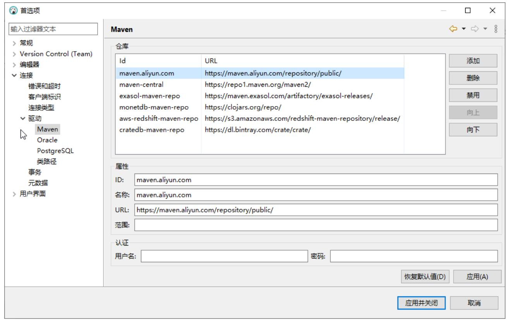

# 启用IPv4转发

```txt
vim /etc/sysctl.conf
#配置转发
net.ipv4.ip_forward=1
systemctl restart network 
```

# Docker安装

https://hub.docker.com/r/clickhouse/clickhouse-server/tags

```shell
docker run -d --name clickhouse-server --ulimit nofile=262144:262144 \
-p 8123:8123 -p 9000:9000 -p 9009:9009 --privileged=true \
-v /mydata/docker/clickhouse/log:/var/log/clickhouse-server \
-v /mydata/docker/clickhouse/data:/var/lib/clickhouse clickhouse/clickhouse-server:22.1.4. 
```

ulimit对单一进程允许最大打开的文件句柄数量为262144  
默认http端口是8123   
tcp端口是9000   
同步端口9009

# 启用防火墙

```shell
firewall-cmd --zone=public --add-port=8123/tcp --permanent
firewall-cmd --zone=public --add-port=9000/tcp --permanent
firewall-cmd --zone=public --add-port=9009/tcp --permanent
firewall-cmd --reload 
```

在任何其他情况下不能将ClickHouse服务器暴露给公共互联网，我们是学习使用部署外网ClickHouse体验平台界面实际上是通过ClickHouse 的HTTP API接口实现的确保它只在私有网络上侦听，并由正确配置的防火墙监控。

# ClickHouse-client接入

```batch
docker exec -it clickhouse-server /bin/bash 
```

```sql
#查看已有数据库
show databases;
#执行SQL语句生成柱图
SELECT bar(number, 0, 10) FROM numbers(10)
```

# DBeaver客户端接入

https://dbeaver.io/

为了提高下载速度，在DBeaver需要添加aliyun maven镜像

DBeaver基于JDBC访问各种数据源，因此需要依赖Maven仓库下载JDBC驱动，这个过程往往比较慢，国内需要增加镜像源



https://maven.aliyun.com/repository/public