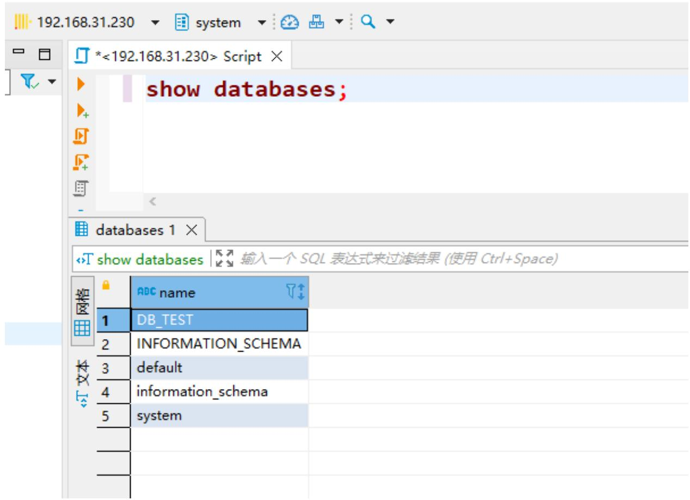

# ClickHouse如何定义数据库

## 创建数据库

```sql
CREATE DATABASE IF NOT EXISTS db_name [ENGINE = engine]
DROP DATABASE IF NOT EXISTS db_name 
```

其中，IF NOT EXISTS表示如果已经存在一个同名的数据库，则会忽略后续的创建过程；[ENGINE=engine]表示数据库所使用的引擎类型（是的，你没看错，数据库也支持设置引擎）。数据库目前一共支持5种引擎，如下所示。

Ordinary：默认引擎，在绝大多数情况下我们都会使用默认引擎，使用时无须刻意声明。在此数据库下可以使用任意类型的表引擎。  
Dictionary：字典引擎，此类数据库会自动为所有数据字典创建它们的数据表。  
Memory：内存引擎，用于存放临时数据。此类数据库下的数据表只会停留在内存中，不会涉及任何磁盘操作，当服务重启后数据会被清除。  
Lazy：日志引擎，此类数据库下只能使用Log系列的表引擎。  
MySQL：MySQL引擎，此类数据库下会自动拉取远端MySQL中的数据，并为它们创建MySQL表引擎的数据表。

## 查看数据库

```batch
find / -name DB_TEST* 
```

```txt
[root@localhost ~]# find / -name DB_TEST*
/mydata/docker/clickhouse/data/data/DB_TEST
/mydata/docker/clickhouse/data/metadata/DB_TEST
/mydata/docker/clickhouse/data/metadata/DB_TEST.sql 
```

与此同时，在metadata路径下也会一同创建用于恢复数据库的DB\_TEST.sql文件。使用SHOW DATABASES查询，即能够返回ClickHouse当前的数据库列表



<details>
<summary>text_image</summary>

show databases;
databases 1
show databases | 输入一个 SQL 表达式来过滤结果 (使用 Ctrl+Space)
网格 ABC name
1 DB_TEST
2 INFORMATION_SCHEMA
3 default
4 information_schema
5 system
</details>
